# 渐进阅读基本概念与操作介绍

> 作者：[叶峻峣](https://www.zhihu.com/people/L.M.Sherlock)

在前文《[同时阅读上百篇文章？渐进阅读之程序员视角(IRAPP)](./2450557)》中，我通过类比进程切换，介绍了渐进阅读的整体概念和 6 个动作。

本文将在此基础上引入 SuperMemo 中渐进阅读的细节概念和具体操作，带大家过一遍在 SuperMemo 里实践渐进阅读的流程。

注：本文不提供下载资源，且以英文界面作为示例。并且，本文介绍的主要操作都是基于快捷键的，相信我，在渐进阅读中你不怎么会用到你的鼠标。

## 目录

[TOC=2,4]

## 概念

### 卡片

在 SuperMemo 中，卡片是我们每次阅读、摘录、改写、挖空、复习的基本单位。最常见的两种卡片是摘录卡片（Topic）和问答卡片（Item）。让我们先来了解一下它们吧！

### 摘录卡片 Topic

摘录卡片，就是用于阅读的文本。它可以是一整篇文章，也可以是几个段落，甚至是一句话。

:-: 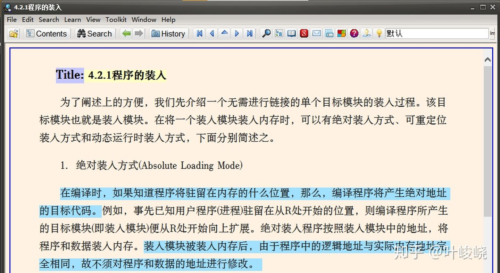

:-: 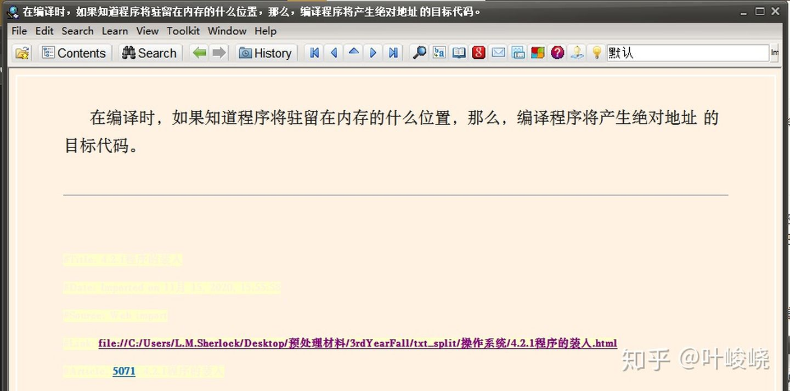

摘录卡片是我们用于生成问答卡片的基础。在渐进阅读中，摘录卡片会随着我们的深入理解，从完整的文章生成多个独立的片段，再逐步拆分出大量能够完整说明一个简单知识的句子。

每一次摘录（高亮）文本，SuperMemo 就会生成一张对应的摘录卡片，以供后续阅读和处理。

当一张摘录卡片已经提炼到满意的程度时，我们就可以对其进行挖空，生成问答卡片。

### 问答卡片 Item

问答卡片，就是用于自我测试的问题-答案-对。在渐进阅读中，问答卡片通常是用挖空创建的。

:-: 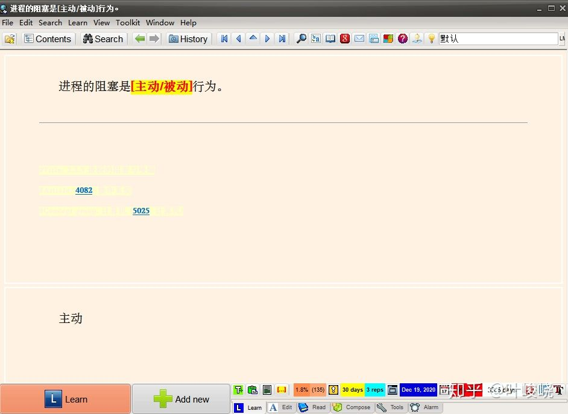

:-: 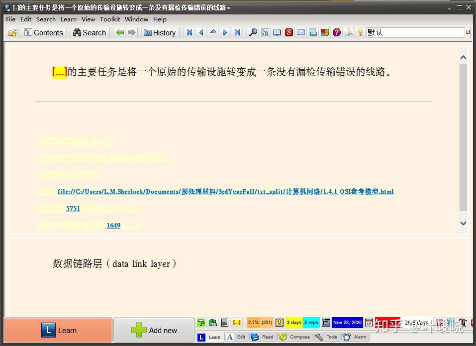

问答卡片和摘录卡片的主要区别是，问答卡片需要我们主动回忆来测试自己是否记住该知识，而摘录卡片只用于被动阅读、改写、摘录。

### 知识树 Knowledge Tree

知识树是渐进阅读中，随着我们的摘录、挖空而自动生成的大纲结构。

:-: 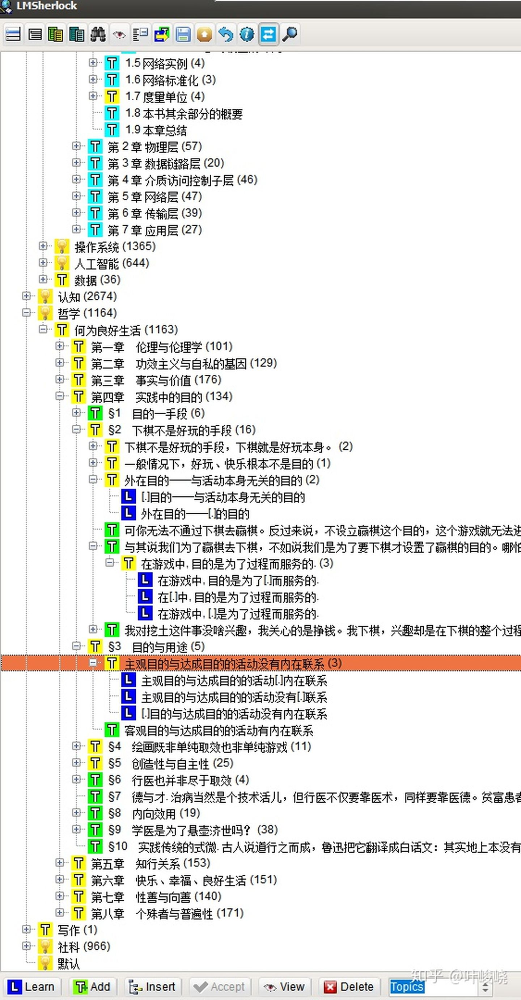

通过拖动、添加，我们可以手动调整知识树的结构，或添加新的卡片。

### 优先级 Priority

优先级是指卡片在你的知识集合中的优先程度。渐进阅读使学习大量知识变得容易，但是如果我们不能有效的处理所有导入的知识，我们可能会浪费时间在低优先的材料上，而忽略了高优先的材料。

在渐进阅读中，所有卡片都会按照优先级排序（有一定的随机化），这样就形成了一个优先级队列。

当我们每天学习的时间用完时，没有处理完的待办材料将会被延迟。因此，只有优先级较高的卡片能够达到期望的保留率水平。

如果我们某天没有完成 SuperMemo 安排的学习，不要有压力。有了优先级队列，我们已经做到了最好。只有优先级较低的材料会落下。

:-: 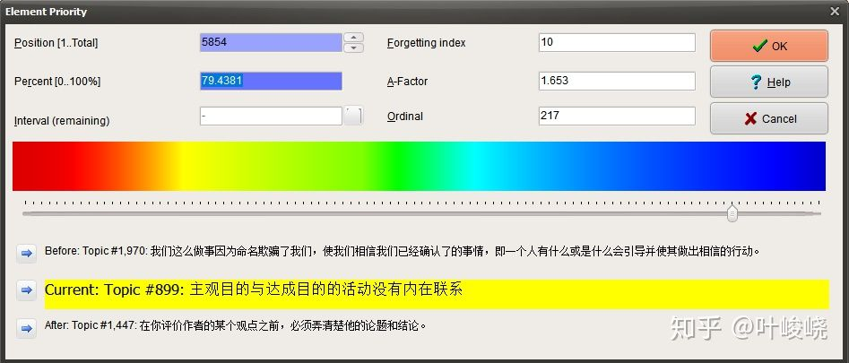

详情请见：[Priority queue 优先级队列 · 语雀 (yuque.com)](https://www.yuque.com/supermemo/wiki/priority_queue#8092dba3)

### 待办队列 Outstanding Queue

待办队列由所有已经到期的卡片组成。默认情况下，每处理 4 张问答卡片，就会出现 1 张摘录卡片。如果到期的所有问答卡片都被处理完毕，将安排剩下的摘录卡片。

通常待办队列里的卡片会根据优先级排序，并加入一点的随机性。

待办队列的完成进度将会显示在状态栏（Status bar）中：

:-: 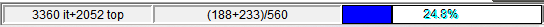

这些数字分别代表：

*   3360 it：集合中的问答卡片数
*   2052 top：集合中的摘录卡片数
*   188：待处理的问答卡片数
*   233：待处理的摘录卡片数
*   560：今天到期的所有卡片数（注：包括被自动延迟的卡片、今日新增的卡片）
*   24.8%：目前的学习进度

### 概念组 Concept Group

概念组就类似于 Anki 中的牌组，可以用来归类不同的卡片。

:-: 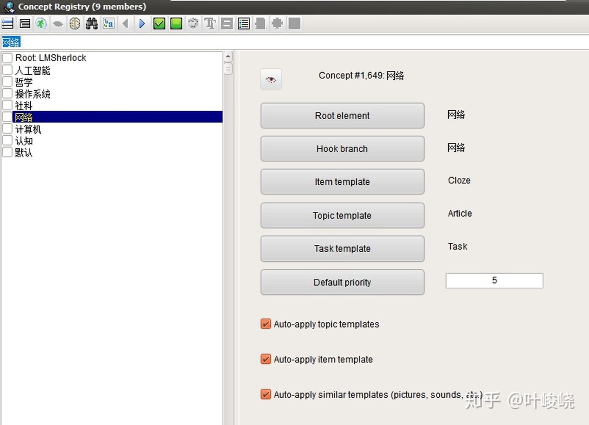

同时，概念组还可以设置对应的卡片模板和默认优先级。所有新增的卡片都会设为概念组默认的模板和优先级。

## 操作

了解了基础概念后，让我们学习一下在 SuperMemo 中实践渐进阅读的几个具体操作吧！

### 添加概念组

Alt + C，打开知识树的窗口。右键一个节点，建立一个文件夹（Folder）

:-: 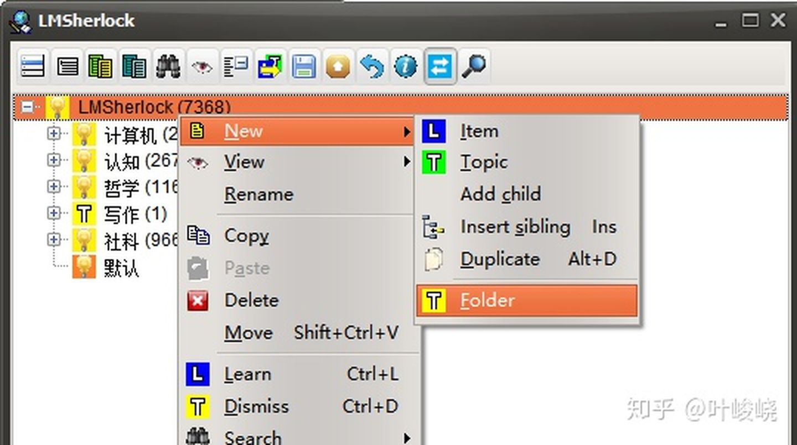

点击文件夹节点，Ctrl + K 或右键，创建概念：

:-: 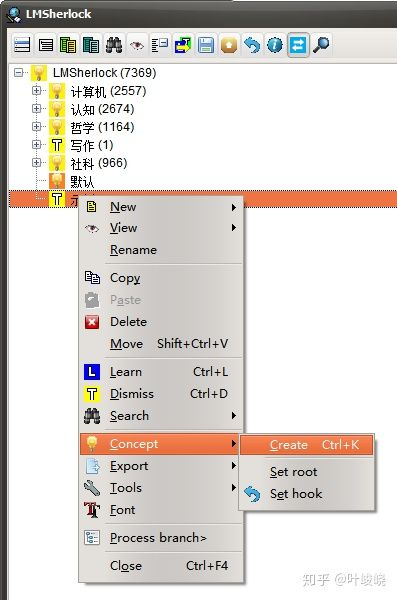

输入概念的名字，点击 OK 即可：

:-: 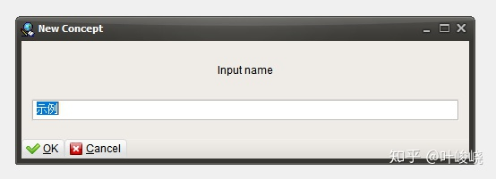

注：新建的概念组会成为默认的概念组

### 设置默认概念组

点击菜单栏上的电灯泡：

:-: 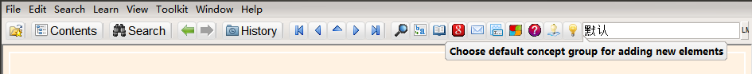

在左侧选择一个概念组，再点击 Accept

:-: 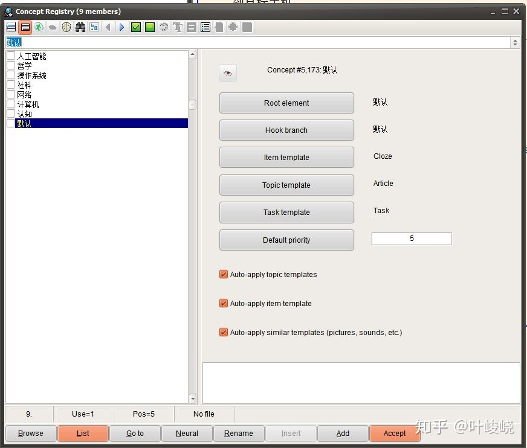

恭喜你，你已经设置好了默认的概念组，之后导入的文章都会添加到该概念组之中。

注：勾选 Auto-apply 可以帮助你自动设置模板，这样新建卡片的时候就不用自己设置了。

### 导入文章

这里只介绍导入可复制材料的最简单方式，其他材料的导入将会在后续文章中专门介绍。

注：大部分操作只要有快捷键我就只会用快捷键。掌握快捷键是进行沉浸式渐进阅读的重要一环。

一步一步来：

1.  在任何地方，Ctrl + C，复制你感兴趣的内容
2.  在 SuperMemo 中，Alt + N，添加一个新的摘录卡片
3.  在新生成的空白摘录卡片中，Ctrl + V，粘贴你复制好的文本

:-: 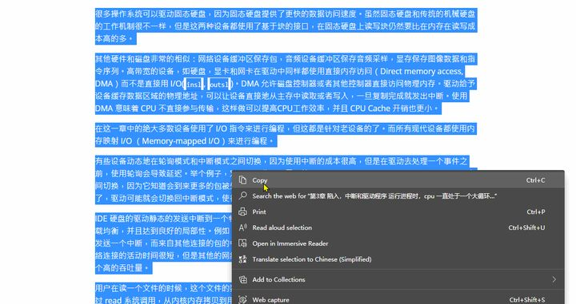

恭喜，你已经导入好了一篇文章！

默认情况下，这篇文章会在 15 天内(不含当天)安排你阅读。

如果你已经急不可待，Ctrl + Shift + J，然后输入一个数字，将卡片插入当天的待办队列的特定位置。

:-: 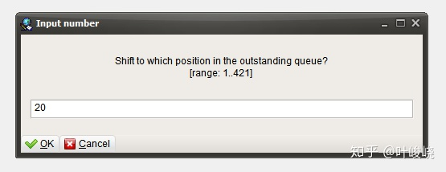

PS：这里你可能会对粘贴后的格式感到困扰，关于如何便捷的处理 SuperMemo 中的文本格式，我会将在后续教程中补充。

### 阅读文章

Ctrl + L，开始你的学习，如果出现了一张摘录卡片，那么我们就可以开始阅读了。

:-: 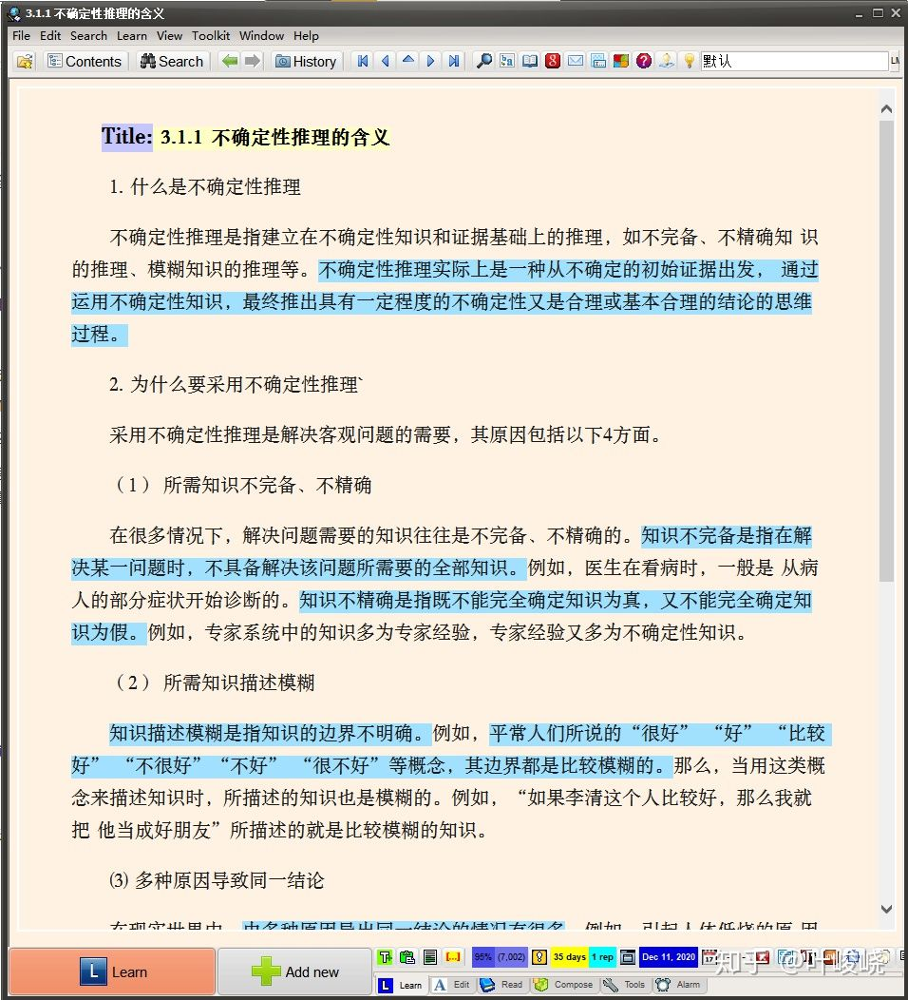

可能用到的快键键：

*   E（或点击文本）：进入编辑模式
*   Ctrl + F7：设置阅读点，下一次遇到这篇文章时，SuperMemo 会自动跳到阅读点（默认的阅读点是你最后一个进行摘录的位置）
*   Esc：退出编辑模式，
*   Enter（在退出编辑模式情况下）：完成阅读并处理下一张待办卡片
*   Ctrl + D：忽略该卡片，SuperMemo 将不会再安排你复习该卡
*   Ctrl + Shift + Enter：忽略并删除卡片内容
*   Delete：删除卡片及其分支（就是说从这张卡片摘录或挖空生成的卡片也会一起删掉，慎用）

如果在阅读中遇到很困难的片段，可以参考以下做法：

> 来源：[ 处理难以理解的文章 · 语雀 (yuque.com)](https://www.yuque.com/supermemo/wiki/additional_skills_in_il#AlnQS)
>   
> 在增量阅读中，我们经常会遇到难以理解的材料。我们将需要提高分析能力，以帮助我们确定困难的原因。如果罪魁祸首是作者，则删除该文章。如果我们需要先巩固集合中的其他学习材料，则延迟阅读文章。如果我们需要更多知识储备，则延迟文章并导入更多相关知识的文章，以增进理解。别忘了**有些文本并不适合增量阅读**（例如，科学实验的描述，数学推导，源代码中的编程示例，案例研究等）。在这种情况下，请使用传统的全面分析方法，汇总分析结果，并使用SuperMemo跟踪自己的总结。  
>   
> 这是解决增量阅读中复杂性的方法：  
>   
> 从开头开始阅读文章。找到困难片段后，对其进行分析，并诊断出理解问题的原因  
>   
> 如果本文的其余部分不太依赖困难片段，请将其摘录出来并继续阅读  
>   
> 如果在不理解困难片段的情况下无法理解本文的其余部分，请选择以下选项之一：  
>   
> 如果我们需要更多的知识来理解片段，请推迟文章（从元素菜单选择**Learning >> Reschedule**或`Ctrl`+`J`**重新安排**时间）  
>   
> 如果该片段过于复杂且没有阅读欲望（例如，由于语法，措辞，表述，逻辑等方面的错误），请删除该文章，并寻找替代材料  
>   
> 如果决定使用`Ctrl`+`J`推迟文章，请先确定需要哪些新知识，然后再返回困难的片段。  
>   
> 列出字典条目、百科全书文章、网络上需要进一步处理的文章。将搜索的材料安排为单独的摘录卡片，或尝试立即搜索新知识  
>   
> 当我们感觉自己能理解困难的文章时，估算所需的时间间隔，并且使用`Ctrl`+`J`设置间隔。如果文章包含高优先级知识，那么最好还是谨慎一点并安排尽早复习。

### 摘录 Extract

选中你认为重要的内容， Alt + X，选中的文本会被蓝色高亮，并生成一张以选中文本为内容的摘录卡片。

新生成的摘录卡片会在几日内安排再次阅读，这取决于原文本的优先级。

> Shift + Alt + X 可以在摘录后直接设置摘录部分的阅读时间、优先级，不过普通的摘录一般够用了。

关于摘录什么样的内容，这里有几点经验：

*   不需要预备知识的事实内容
*   有一定理解的知识片段
*   重要的片段（可能不太理解，摘录出来只是为了后续处理）

其实就是划重点，大家应该都划过，按照自己的习惯来即可。

如果遇到难以摘录内容，可以直接编辑原文，写下自己的总结，然后摘录自己的笔记即可。

简化卡片的技巧，请参考：

*   [Anki高考的20条原则—来自《有效的学习：组织知识的20条原则》](./2454060)
*   [20 条知识表述规则（20 周年版）](./2454061)
*   [基于主动回忆的学习中的知识结构与表述](./2454062)
*   [间隔重复中的简化与冗余](https://zhuanlan.zhihu.com/p/283017134)

### 挖空 Cloze

选中要挖空的关键词或短语，Alt + Z，选中的文本会被橙色高亮，并生成一张正面为挖空句子，背面为挖空内容的问答卡片。

:-: 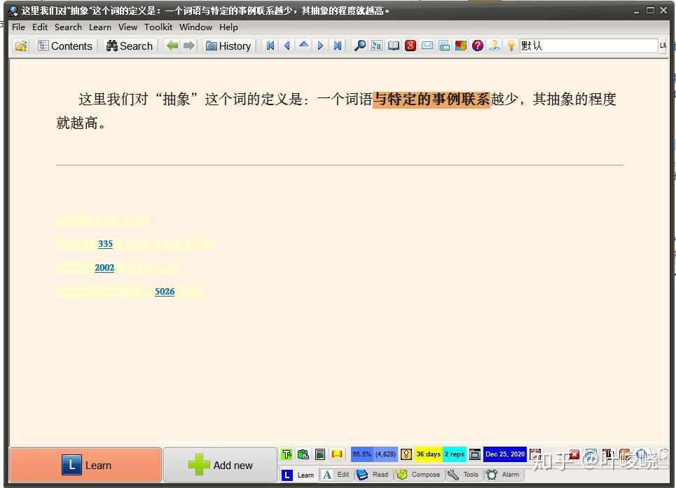

:-: 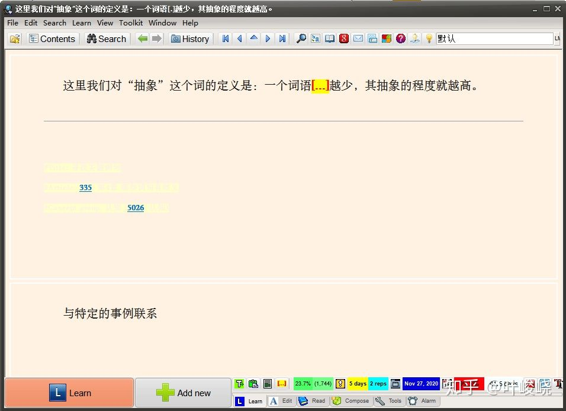

该问答卡片也会在 1~30 天内安排复习（一般优先级高的都会在 5 天内复习）

### 主动回忆

在使用渐进阅读几天后，我们可能会遇到第一张问答卡片。只需要先看正面回忆背面，然后查看答案自觉打分即可。

:-: 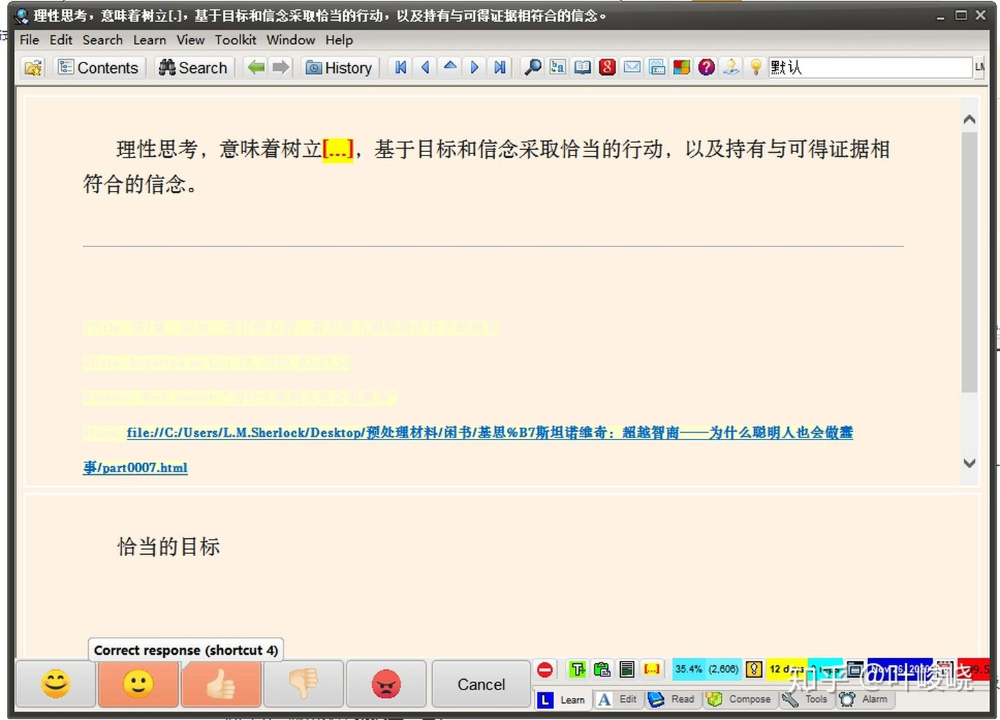

SuperMemo 的评分有 5 个档次，其中 1, 2 对应遗忘，3,4,5 对应想起，具体的评分标准有人总结为下图：

:-: 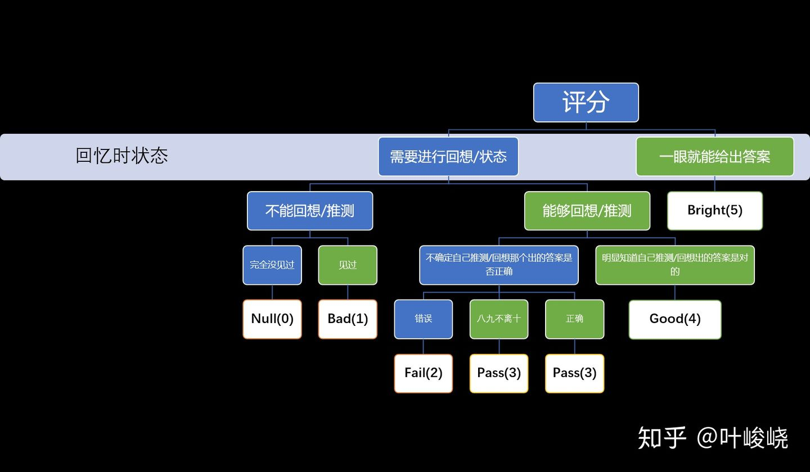

当然，你也可以设定自己的标准，算法会解决背后的复习问题。

### 设置优先级

新增卡片的优先级是由对应的概念组默认设置的。当然，我们可以做出自己的决定，设置一切卡片的优先级。

Alt + P，呼出优先级设置菜单：

:-: 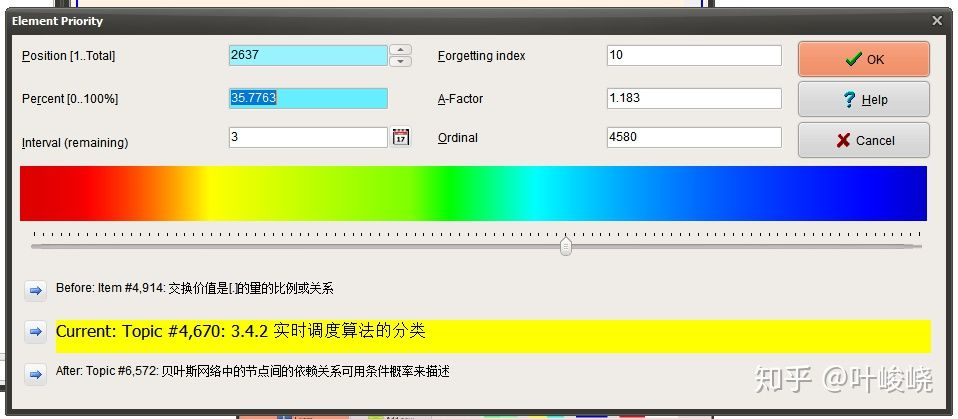

拖动滑块即可调整优先级。左边是高优先，右边是低优先。

### 其他技巧

这里是一些不太好分类，但是可能会比较常用的技巧：

### 常用快捷键

*   Ctrl + ↑：查看上一级，通常是你摘录出来的摘录卡片和问答卡片的原文。
*   Alt + ←：查看上一张卡片，如果你做了摘录或挖空，上一张卡片就是你刚刚摘录或挖空的卡片。
*   Ctrl + Shift + M：为当前卡片选择模板
*   Ctrl + Shift + R：为当前卡片设置下一次查看的时间（一般不用，除非你觉得这个卡片很重要或者很不重要）
*   Ctrl + Shift + 1：将选中内容统一格式。例如，一段文字为 12**3456**，选中 1 到 6，按下组合键，文字将统一格式，变成 123456。

### 自动排序和自动延迟

自动排序是默认开启的：

:-: 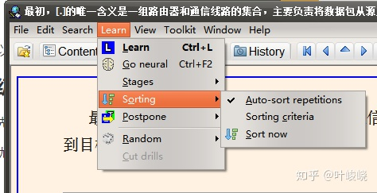

自动延迟需要自己手动开启：

:-: 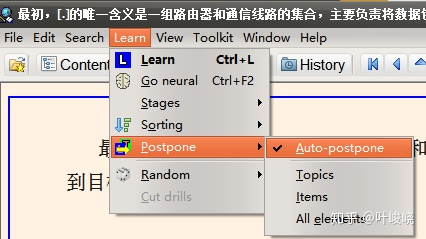

### 窗口布局

SuperMemo 的窗口非常多，我一般在复习时只留一个显示卡片的窗口：

:-: 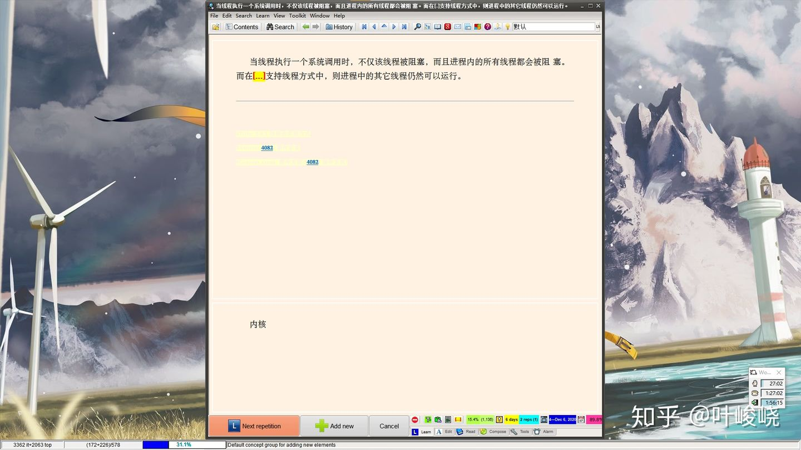

可以通过拖动边框来调整窗口大小，在 Window 菜单中设置要出现的窗口，并用 Save custom layout 保存调整好的窗口：

:-: 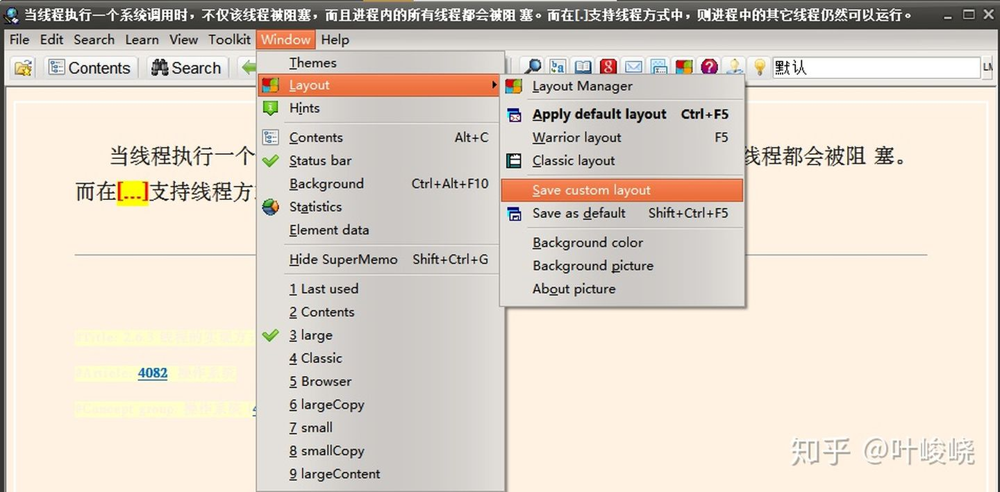

### 参数设置

Tookit》Options 打开参数设置

:-: 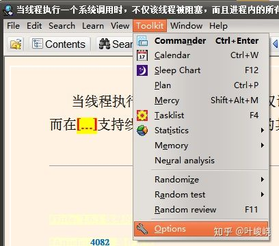

SuperMemo 就没什么参数好设置了，一个全局的遗忘指数（Forgetting index），默认为 10%，即每个卡片只有到遗忘率为 10% 时才会安排复习。

Mdinight shift 就是更新每日待办队列的时间。默认是 0h，也就是午夜更新，熬夜党可以把这个调到 6h，也就是早上 6 点。

Skip final drill 默认是不勾选的，也就是说，当你完成每日复习任务后，会进入 final drill 模式，final drill 会收集当天评分小于 4 的所有卡片，让你加强练习。但是在我看来，死记硬背是不好的，我就跳过了

至于 Interval 这个，默认好像是 7 天，意思是如果间隔大于 7 天就会提示你一下，我嫌它烦人，就把间隔改成 36500 了。

:-: 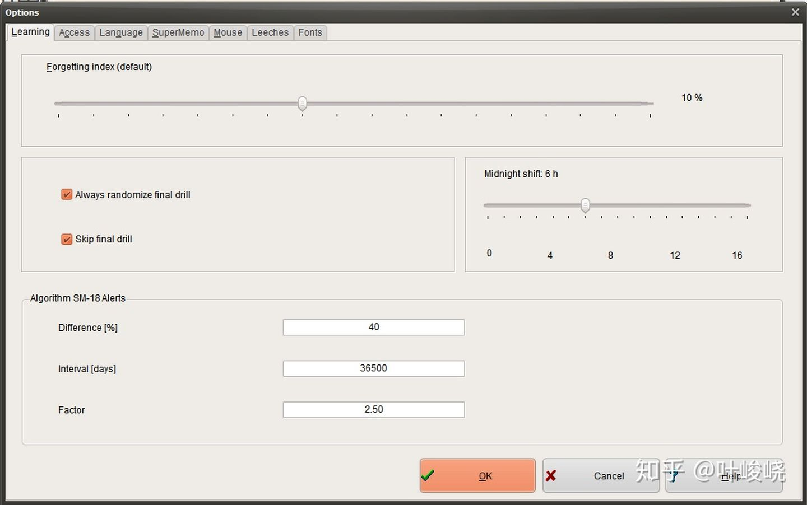

## 结语

以上就是本期介绍的全部内容，这些操作是 SuperMemo 中最常用也是最有用的。如果你有任何疑问，欢迎评论区讨论。