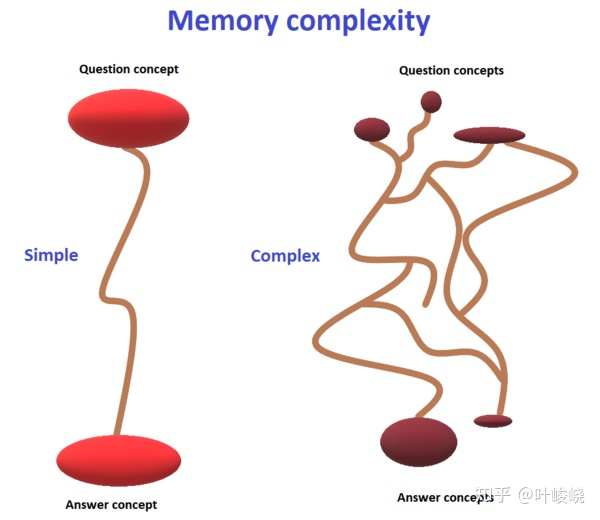

# 20 条知识表述规则（20 周年版）

> 作者：[叶峻峣](https://www.zhihu.com/people/L.M.Sherlock)

## 目录

[TOC=2,4]

## 引言

我们在学习中对知识的表述方式对记忆有着巨大的影响。措辞得当的问题会让学习变得轻松。结构合理的知识将有助于将知识终身保存在记忆中。

1999年编撰的《[有效学习：知识表述的20条规则](https://link.zhihu.com/?target=http%3A//super-memory.com/articles/20rules.htm)》，描述了有效表述好问题以保持长期[记忆](https://supermemo.guru/wiki/Retention)所需的最重要规则。下面我提供一个简明扼要的执行摘要（特别是对[渐进阅读](https://www.yuque.com/supermemo/wiki/incremental_reading)感兴趣的人）。

## 摘要：20 条规则

*   [不要学你不理解的东西](https://zhuanlan.zhihu.com/p/281085595)
*   先学后背
*   从基础开始，再到复杂
*   [保持问题简单](https://zhuanlan.zhihu.com/p/283017134)
*   图片帮助记忆
*   学习助记技巧，比如数字桩
*   避免列表、集合和枚举（它们可以用[挖空](https://supermemo.guru/wiki/Cloze_deletion)来处理）
*   个性化并提供例子
*   [挖空](https://supermemo.guru/wiki/Cloze_deletion)速度很快，并有很好的[助记效果](https://supermemo.guru/wiki/Mnemonic_anchor)
*   使用[冗余](https://zhuanlan.zhihu.com/p/283017134)（从不同角度提出类似的问题）
*   使用[参考文献](https://help.supermemo.org/wiki/References)

## 新规则：渐进阅读

随着[渐进阅读](https://www.yuque.com/supermemo/wiki/incremental_reading)的出现，规则已经被修改，并重新确定了优先级。

[渐进阅读](https://www.yuque.com/supermemo/wiki/incremental_reading)中表述策略的改变：

*   建立理解可能是学习过程的一部分，在理解不充分的段落中[挖空](https://supermemo.guru/wiki/Cloze_deletion)是可以接受的
*   学习和记忆可能同时进行
*   在学习过程的早期，[项目](https://www.yuque.com/supermemo/wiki/item)可能很[复杂](https://zhuanlan.zhihu.com/p/304800091)。取决于[知识优先级](https://www.yuque.com/supermemo/wiki/priority\_queue)和可用的时间，它们会[逐步简化](https://zhuanlan.zhihu.com/p/283017134))。
*   对同一语句的不同表述进行多次[挖空](https://supermemo.guru/wiki/Cloze_deletion)，往往可以替代记忆技巧（见：[知识达尔文主义](https://zhuanlan.zhihu.com/p/264940693)）。
*   列表、集合和枚举可以通过[挖空](https://supermemo.guru/wiki/Cloze_deletion)轻松解决。
*   为了实现个性化，在学习的课文中加入自己的故事，[创造性地阐述](https://www.yuque.com/supermemo/wiki/incremental_writing)。

## 元规则：学习的乐趣

一个简单而通用的试金石，就是[学习的乐趣](https://www.zhihu.com/question/429432467/answer/1578551193)。每当你看到乐趣下降时，再来看看这篇文章，看看能不能找到可能导致乐趣下降的违规行为。

## 元规则：适用性

我们应该力求知识的最大[适用性](https://supermemo.guru/wiki/Applicability)。

[人类的智慧](https://supermemo.guru/wiki/Simple_formula_for_high_intelligence)是建立在知识的基础上的，其中[抽象知识](https://zhuanlan.zhihu.com/p/270927894)的作用尤为重要。抽象知识以规则为基础，如2+2=4。这种规则可以在多种情境中运用，有助于提高解决问题的能力。规则比事实更有用。例如，知道2+2=4（规则）比知道朋友的电话号码是4（事实）更有用。规则和公式比事实更[适用](https://supermemo.guru/wiki/Applicability)。更多详情请看：[抽象知识](https://zhuanlan.zhihu.com/p/270927894)

## 元规则：简单

在表述知识时，我们应始终努力形成以良好的理解为背景的[原子记忆](https://zhuanlan.zhihu.com/p/304800091)。如果学习是愉快的，[项目](https://www.yuque.com/supermemo/wiki/item)可能就会表述得很好。这张图解释了为什么简单的记忆更容易[保留](https://supermemo.guru/wiki/Retention)：

:-: 

*   图：[记忆复杂性](https://zhuanlan.zhihu.com/p/304800091)说明了[最小信息原则](https://supermemo.guru/wiki/Minimum_information_principle)的重要性。在记忆简单的问题和答案时，我们可以依靠简单的记忆联系，并在复习时统一刷新这种联系。复杂的记忆，其概念的激活方式可能是不完整的，或者是根据上下文的不同顺序。因此，复习时很难产生[记忆稳定性](https://supermemo.guru/wiki/Memory_stability)的统一提高。复杂的项目难以记忆。一个简单项目的例子可能是一个单词对，例如 apple = pomo（世界语）。而认识一个苹果可能需要一个复杂的联系网。apple 和 pomo 之间的联系是不可简化的（即最大限度地简化）