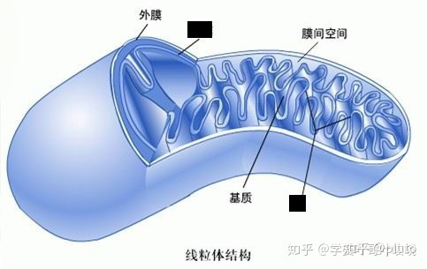
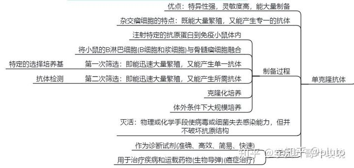
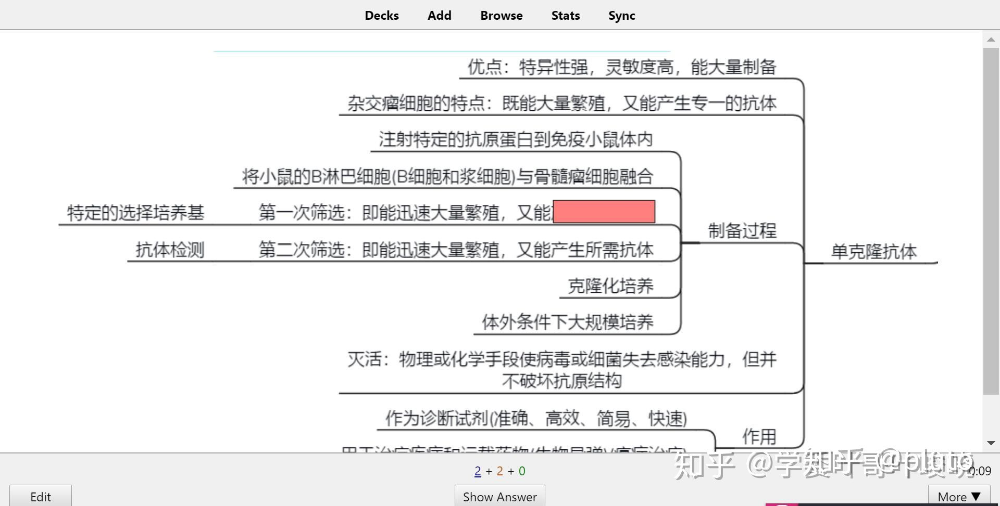

# Anki高考的20条原则—来自《有效的学习：组织知识的20条原则》

> 编者：[倪梓晋](https://www.zhihu.com/people/liu-kan-3-27)
>
> 作者兼译者：[叶峻峣](https://www.zhihu.com/people/L.M.Sherlock)

## 目录

[TOC=2,4]

## 第一、如果我不理解这个材料，那我不如不学

学习不理解的东西可能是天方夜谭，但是事实证明确实有很多学生正在学习他们并不理解的材料。这往往是糟糕的教材和逼近的考试导致的，由于时间紧迫，没有选择，我们可能对教材囫囵吞枣，死记硬背。

比如我可以对化学元素的符号都没认全，就去看化学方程式。我当然可以一个字母一个字母、一个符号一个符号地硬记。但是这样盲目学习的时间是巨大的。而更为严重的是，这种所谓知识的价值简直微不足道。我只是记住了这些符号序列，而对化学反应一无所知。

当然，这只是一个极端的例子。更为常见的情况是，在没有理解概念和定义的情况下，去试图记住看不太懂的定理、公式。或者在不清楚二级结论的推导与证明就直接记忆和使用。

## 第二、先学再记

开始学习一个科目的知识前，我们就应该对所学的知识建立一个整体印象。只有把在**材料上相互独立**的知识构建为**逻辑上相互联系**的知识大厦，才能大幅度降低我们的学习时间。就如规则一所提到的一样，一个独立的知识点就像方程式里的一个符号，没有联系就没有理解，就如同死记硬背。

所以不要从零碎的材料中学习(就比如我们经常做的高考模拟卷)！先阅读材料上可以把这些知识整合起来的章节(比如：平抛运动)，然后才使用独立的问答来进行学习。（如：速度角和路程角的关系是什么？）

## 第三、从基础开始

对于学习材料的整体印象的建立并不需要考虑到细枝末节处。恰恰相反，该印象越简单越好，我们的学习材料的基础章节也是越短越好。越是简单的知识模型越是容易被理解。日后我们可以在此基础上进一步构建。

不要忽视基础。记忆看似浅显的知识并不是在浪费时间。基础知识可能会突然变动(有些教材在使用概念时喜欢在开头规定限定条件，或者把一些术语简写)，而且记忆简单的知识所花费的时间也不多，所以还是保险一点好。要知道，通常我们会花费 50% 的时间来复习学过的材料中的 3% - 5% 【[来源](https://www.supermemo.com/articles/theory.htm)】！基础知识只要花很少时间就能记住。然而，对基础知识的疏忽往往代价沉重(一个简单而根深蒂固的概错误概念很可能害我们自己白白浪费了学习后续章节的时间)

## 第四、最小信息原则

我们的学习材料尽可能以简单的方式进行组织。

1、简单即容易

根据定义，简单的材料容易记忆。事实证明，简化的材料让大脑更容易以相同方式进行处理。我们可以想一想迷宫。当我们复习一个材料时，我们的大脑就像在通过一个迷宫(可以把脑回路看成错综的路径)通过迷宫时，大脑会在迷宫的路上留下了线索。如果大脑能以唯一方式通过，那么留下的线索就简单而便于跟随，此路径就容易重复通过。反之，如果有很多组合的话，每一次通过就会留下不同的线索彼此干扰，从而难以找到出口。这同样发生在大脑细胞层面，每次复习复杂材料时，不同的大脑突触连接会被激活。

2、简单易安排

假设我们将使用最优重复间隔法来复习学过的材料（如 Anki ）。如果我复习的一个学习卡片是由两个子知识点构成的，那么我将需要足够频繁的复习才能把较难的子知识点记住。若把复杂知识块拆分成各个子知识点，各点的复习就能以各自的节奏进行从而节省了时间。一个缺乏经验的学生所创建的学习卡片，往往可以被轻易的划分成十个或更多的子知识点！虽然，学习卡片的数量增多了，但子知识点复习时间却往往很少，以致其益处远超于

1)一遍遍忘记复杂内容

2)过短的复习间隔

3)实际只记住了部分内容

所付出的代价。

下面是一个典型的例子：

**组织很差的知识点 - 复杂而冗长**

问：衰老细胞的特征是什么？

答：细胞内的水分减少，结果使细胞萎缩，体积变小，细胞代谢的速率减慢。细胞内多种酶的活性降低。细胞核的体积增大，核膜内折，染色质收缩、染色加深。细胞膜通透性改变，使物质运输功能降低。

**组织良好的知识点 - 简单而明确**

· 问：衰老细胞的体积会怎么变化？
· 答：变小。

· 问：衰老细胞的体积变化的具体表现是什么？
· 答：细胞萎缩。

· 问：衰老细胞的体积变化原因是什么？
· 答：细胞内的水分减少。

· 问：衰老细胞内的水分变化对细胞代谢的影响是什么？
· 答：细胞代谢的速率减慢。

· 问：衰老细胞内的酶活性如何变化？
· 答：活性降低。

· 问：衰老细胞的细胞核体积如何变化？
· 答：体积变大。

· 问：衰老细胞的细胞核的核膜如何变化？
· 答：核膜内折。

· 问：衰老细胞的细胞核的染色质如何变化？
· 答：染色质收缩。

· 问：衰老细胞的细胞核的染色质变化对细胞核形态的影响是？
· 答：染色加深。

· 问：衰老细胞的物质运输功能如何变化？
· 答：物质运输功能降低。

· 问：衰老细胞的物质运输功能为何变化？
· 答：细胞膜通透性改变。

我们可以试验一下尝试用上述两种方法来学习两个主题，然后看看最小信息原则所能带来的好处。从长远来讲好处尤其明显，例如，我们记忆知识所需时间越多，我们从简化材料所获收益也就越多。

注意，上述例子中的问题很简短，答案就更为简短了！我们要求单次复习中从记忆中汲取的信息量足够小，回答就要尽可能的短！

当然，大家可能注意到了，组织很差和良好的知识点并不完全等同。比如：尽管我们记住了衰老细胞的物质运输功能为何变化，而起初我们很可能忘记衰老细胞还有这个特点。但是这些问题都可以解决，如增加更多问题，或者使呈现的问题更为精确。

为此，当老师把你叫到黑板前，你可能没办法流利背诵完整的衰老细胞的特点。然而我敢说，你学习的的最终目的，并不是为了在班级里显得熠熠生辉。

## 第五、填空题简单而有效

填空题是以省略号替换了部分缺失内容的句子。填空练习就是运用填空题要求学生将缺失的部分填写完整的练习形式。比如：在解三角形中，\[...\]问题多要使用余弦定理。(面积)

作为初学者，如果你发现很难遵循最小信息原则，请用填空题。如果你是高阶用户，你同样会喜欢填空题。填空题是将教科书内容转化为知识点的快捷有效方法，并适合以间隔重复的方法来学习。填空题构成了一种称之为“增量阅读”的快速阅读和学习技巧的核心。

**组织很差的知识点 - 复杂而冗长**

· 问：罗伯特森的主要贡献是什么？
· 答：罗伯特森用电子显微镜观察到细胞膜的暗-亮-暗的三层结构，提出细胞膜蛋白质-脂质-蛋白质3层结构。

**组织良好的知识点 -**简单的填空题

· 问：\[...\]用电子显微镜观察到细胞膜的暗-亮-暗的三层结构，提出细胞膜蛋白质-脂质-蛋白质3层结构。
· 答：罗伯特森

· 问：罗伯特森用\[...\]观察到细胞膜的暗-亮-暗的三层结构，提出细胞膜蛋白质-脂质-蛋白质3层结构。
· 答：电子显微镜

· 问：罗伯特森用电子显微镜观察到细胞膜的\[...\]的三层结构，提出细胞膜蛋白质-脂质-蛋白质3层结构。
· 答：暗-亮-暗

· 问：罗伯特森用电子显微镜观察到细胞膜的暗-亮-暗的三层结构，提出细胞膜\[...\]3层结构。
· 答：蛋白质-脂质-蛋白质

## 第六、使用图片

视觉皮层是大脑中用来处理视觉刺激的部分。该部分在进化过程中得以充分的发展，这也是为什么我们常常会说一图胜千言。事实上，如果你观察一幅图片中的细节以及记忆这些细节的容易程度，你会发现，我们的语言能力相较于视觉处理能力真是差太多了。对于记忆也是如此，用图片展示的信息通常不太容易忘记。

当然，组织一道简单的问答题比找到一幅切题的图片要花费更少的时间。这也是为什么当你在学习过程使用图片时，往往需要在性价比上做出权衡。使用得当的图片，在诸如解剖学，地理学，几何学，化学和历史等领域，会极大的减少你的学习时间。

图片的威力也解释了为什么托尼·博赞的思维导图概念会如此流行。思维导图是一种将各组成部分连接起来的抽象图片，以此来反映个体概念间的逻辑关联。

**无益的组织形式**

问：线粒体中外膜和基质之间是什么结构？

答：线粒体内膜和线粒体嵴(线粒体内膜向线粒体基质折叠形成嵴)

**有效的组织形式**

问：图中被遮挡的是什么结构？

:-: 

答：线粒体内膜和线粒体嵴

## 第七、使用助记技巧

助记技巧是那些使我们更容易记忆的技巧。这些技巧往往有着令人惊讶的效果。对大部分学生来说，10岁少年就能记住50张卡牌排序的景象让人几乎以为发现了少年天才。然而人们惊讶的发现，在一些训练后，掌握这样的技巧是如此的容易。这些技巧每个人都可以获得而不需要而外的能力。

在我们开始相信掌握这类技巧将帮我们永久解决遗忘的问题之前，要注意了，通往长久而有效记忆的真正瓶颈并不是快速记忆，事实上快速记忆是最容易的部分。真正的瓶颈在于保持数月，数年，甚至终身的记忆！要实现后者，我们需要使用 Anki 并遵守本文中提到的20条准则。

现在有很多有关助记技巧的书籍，也许托尼·博赞的思维导图是其中最流行和最受重视的。你可以在网上搜索关键词：mind maps(思维导图)，peg lists(记忆宫殿，助记挂钩), mnemonic techniques(助记技巧) 以获得更多信息。

经验表明，在一些训练后，我们有意的将助记技巧运用到学习中的例子只占1-5%，但随着时间的推移，我们将下意识地使用这些技巧。

下面是一个思维导图的例子：

:-: 

## 第八、使用图像填空

图象填空和文字填空一样，只不过是把缺失的文字替换成确实的图象而已。比如：在学习解剖学时，你可以展现一副复杂的图象，有一小部分缺失了。学生的任务是把缺失的部分说出来。同一副图象可以用来组织10-20个知识点，对于每个知识点可用图片中特定的部分来询问。图像填空对于学习地理非常有帮助。

下面是一个图像填空的例子：

:-: 

红色方块遮挡的部分是什么？

## 第九、避免使用集合

集合就是一堆有特定性质的东西的组合。比如：一个水果的集合就是由桃子、梨子、苹果组所组成的。一个典型的例子是，当要求列出一个集合的所有成员时，这样的内容是很难学习的。

例如：三角函数的变换公式有哪些？因为基于集合的记忆成本非常高，所以你应该尽量避免这种学习方式。如果集合是必须的，那么你应该尝试着把它转化成枚举类型。枚举是有序列表（例如，按照三角函数名排列的三角变换公式列表）。枚举类型也很难记忆而应尽量避免。然而，枚举相比集合的优势在于它是有序的，它能迫使大脑总是以相同的顺序排列他们。一个排序后的公式列表比无序的列表包含了更多的信息。有点自相矛盾的是，尽管枚举类型包含了更多的信息，它却更容易被记住。其原因在最小信息原则中已经有所讨论：你应该总是让你的大脑以完全相同的方式来重复。

在上述集合的例子中，要求每次重复时以不同的顺序列出公式对记忆产生的效果是灾难性的。如果不依赖助记技巧，枚举或者分组，要记住有着5个以上内容的集合几乎是不可能的。尽管这么说，你可能常常会下意识的运用这些技巧帮你成功克服这类问题。然而即使有这些技巧，也会让你经常失败。因此，尽量避免使用集合！如果你确实需要使用集合，那么把他们转化为枚举类型，并使用处理枚举类型的技巧来应对。

**组织很差的知识点-集合不可接受**

· 问：蒸发浓缩用到的主要仪器有？
· 答：蒸发皿、玻璃棒、烧杯、酒精灯、铁三角、坩埚钳

**组织良好的知识点-把集合转化为有意义的列表！**

· 问：哪些仪器在蒸发浓缩中用来盛放液体仪器是？
· 答：蒸发皿

· 问：蒸发浓缩中需要什么仪器来移动蒸发皿？
· 答：铁架台

· 问：蒸发浓缩中的玻璃仪器有？
· 答：玻璃棒、烧杯、酒精灯

· 问：蒸发浓缩中蒸发皿与什么仪器直接接触？
· 答：铁三角

· 蒸发浓缩用到的主要仪器有{{c1::蒸发皿}}、{{c2::玻璃棒}}、{{c4::烧杯}}、{{c5::酒精灯}}、{{c6::铁三角}},还有取{{c1::蒸发皿}}用{{c3::坩埚钳}}

在上面的例子里，我们把 6 个仪器的集合转换成了 5 个问题。其中，4 个问题是含有 1-3 项内容的集合，以及 1 个含有 6 项内容的枚举。把它放到 Anki 里，看看按照仪器作用来产生这么一张蒸发浓缩仪器表是多么容易。看到使用蒸发皿时所用的技巧吗？他们把列在其他问题中的仪器连接起来从而简化了学习过程。相比于原问题，可以看到经过良好组织的知识点所含信息量要多的多。那么，随着简化问题的过程，我们学到了更多的知识。每一个问题都有效的遵循了最小信息原则。你可以进一步尝试着把玻璃仪器拆分，或者用助记技巧来记忆最后的那个枚举列表。当然，只有当你在记忆集合有问题的时候才采取这些分解步骤。(毕竟，分解问题需要额外的时间)

## 第十、避免使用枚举

枚举也是那种很难学习的经典类型，但是它依然比集合更容易让人接受。尽量避免使用枚举。如果你实在无法避免，那么使用填空题(如果可能的话，使用重叠式填空)，学习字母表是使用重叠式填空的一个很好的例子。

**不易学习的内容**

· 问：请按顺序列出字母表
· 答：abcdefghijklmnopqrstuvwxyz

**便于学习的内容**

· 问：字母表的头三个字母是什么？
· 答：A，B，C

· 问：请列出A。。。E之间缺失的字母
· 答：B，C，D

· 问：请列出B。。。F之间缺失的字母
· 答：C，D，E

· 问：请列出C。。。G之间缺失的字母
· 答：D，E，F

用上述的内容来学习字母表会更加容易。其优势在于，基于心理上的原因，这种学习方法让人觉得更加容易：学生不会因为要背诵整个字母排列而必须停下来，他只需要专注于学习材料中的一小部分就可以了。在经过重复记忆后，仍然建议他能够把整个字母表背诵下来。然而，一旦他记住了所有单一的片断，背诵整体字母表就应当是愉悦轻快而少有挫折的行为了。

上面的填空就是重叠式填空题。即在记忆中使用不同的问题来加强枚举中相同的部分(比如：在第2第3项问题中要求记起相同的字母序列C-D)。这样的冗余并没有违背最小信息原则，因为这些额外的信息是由额外的问题项填加的。

象集合中的那个例子一样，你还可以用分组的方式来处理枚举(参见“蒸发浓缩仪器”的例子)，但是填空题更简单而且在多数情况下应该足够了。

诗词是枚举的一个例子(所有的词句都须以预先安排的顺序说出)。当然，因为词句间很强的语义连接和韵律，往往不需要使用填空的方式，就能有效地记忆诗词，而不会沮丧的反复忘记其中的小片段。然而，一旦你发现在自己记忆诗词上有些磕磕碰碰，那么最好用填空的方式把整个诗词拆解，以确保学习过程快捷简单，有效且愉悦。

**不易记忆的诗词**

* 问： 环滁皆山也。……
* 答： 环滁皆山也。其西南诸峰，林壑尤美，望之蔚然而深秀者，琅琊也。山行六七里，渐闻水声潺潺而泻出于两峰之间者，酿泉也。峰回路转，有亭翼然临于泉上者，醉翁亭也。作亭者谁？山之僧智仙也。名之者谁？太守自谓也。太守与客来饮于此，饮少辄醉，而年又最高，故自号曰醉翁也。醉翁之意不在酒，在乎山水之间也。山水之乐，得之心而寓之酒也。

**分解成简单问题项的诗词**

· 问：……。其西南诸峰，林壑尤美，望之蔚然而深秀者，琅琊也。
· 答：环滁皆山也。其西南诸峰，林壑尤美，望之蔚然而深秀者，琅琊也。

· 问：环滁皆山也。……，……，……，……。
· 答：环滁皆山也。其西南诸峰，林壑尤美，望之蔚然而深秀者，琅琊也。

· 问：其西南诸峰，林壑尤美，望之蔚然而深秀者，琅琊也。……，……，……。
· 答：其西南诸峰，林壑尤美，望之蔚然而深秀者，琅琊也。山行六七里，渐闻水声潺潺而泻出于两峰之间者，酿泉也。

· 问：山行六七里，渐闻水声潺潺而泻出于两峰之间者，酿泉也。……，……，……。
· 答：山行六七里，渐闻水声潺潺而泻出于两峰之间者，酿泉也。峰回路转，有亭翼然临于泉上者，醉翁亭也。

· 问：峰回路转，有亭翼然临于泉上者，醉翁亭也。……？……。……？……。
· 答：峰回路转，有亭翼然临于泉上者，醉翁亭也。作亭者谁？山之僧智仙也。名之者谁？太守自谓也。

· 问：作亭者谁？山之僧智仙也。名之者谁？太守自谓也。……，……，……，……。
· 答：作亭者谁？山之僧智仙也。名之者谁？太守自谓也。太守与客来饮于此，饮少辄醉，而年又最高，故自号曰醉翁也。

· 问：太守与客来饮于此，饮少辄醉，而年又最高，故自号曰醉翁也。……，……。……，……。
· 答：太守与客来饮于此，饮少辄醉，而年又最高，故自号曰醉翁也。醉翁之意不在酒，在乎山水之间也。山水之乐，得之心而寓之酒也。

这样子是不是看起来有些不自然？当然！但是一旦你使用了这种方法就会知道它多么有效率了。

## 第十一、与干扰做斗争

当你学习相同的内容时你经常会混淆他们。比如：你可能在区分单词 historic 和 historical 时碰到问题。这种情况在你记忆大量数字时会更加明显，例如：在生物实验的药剂配比。 如果对一项内容的知识使记住另一项内容更加困难了，那么我们称这种情况为记忆干扰。 往往，你可以牢牢的记住某项内容好多年，直到。。。你开始记忆另一项内容，以至于两者都很难记住了！比如，你在学习地理的时候记住了位于委内瑞拉，苏里南和巴西之间的国家是圭亚那。而且，只要复习几次，你就能很容易的回忆起这个事实。然而，一旦你添加了相似的内容并询问所有这些国家以及法属圭亚那和哥伦比亚的位置时，你会突然发现很强的记忆干扰并开始遗忘，简单来说就是，你会混淆，而不知道哪个是哪个了。

对于有经验的 Anki 用户来说，记忆干扰可能是遗忘的最大的一个原因。你永远无法知道它什么时候会发生，应对他的唯一方法就是发现并去除。换而言之，在组织知识点时预测记忆干扰往往是不可能的。干扰可能发生在毫不相干的内容之间，像是 Guyana , Guyard, Guyenne（形似？）以及 Guyana ，kayman 和 ... aspirin（什么鬼？）对于你和别的人来说，记忆干扰的作用方式会很不同。这很难预测。

在记忆干扰产生不良影响前，你应该尽可能的防止这种情况。这有助于减少你学习过程的精神压力。下面是一些提示：

让问题尽可能的清晰。

谨遵最小信息原则。（本文剩余的诸多准则都是基于避免干扰的！）

在记忆干扰发生之前，一旦发现，就要立即去除。（例如：当你看见单词 inept，你想「我知道单词 inept 和 inapt 的意思，但我将不知道哪个是哪个！」）

## 第十二、优化措辞

问题的措辞必须优化，以确保在最短的时间内「点亮大脑中相应的那盏灯」，从而降低错误率，更加明确问题，缩短反应时间，并帮助进入专注的状态。

**需要优化的部分：冗长的完形填空**

· 问：\[...\]：不同物种之间、生物与无机环境之间在相互影响中不断进化和发展，这就是\[...\]，它是生物多样性形成的原因。
· 答：共同进化

**更好：短句可以加速阅读**

· 问：\[...\]：不同物种之间、生物与无机环境之间在相互影响中不断进化和发展，它是生物多样性形成的原因。
· 答：共同进化

**更加好：**

· 问：\[...\]：不同物种之间、生物与无机环境之间在相互影响中不断进化和发展。
· 答：共同进化

**再好点：**

· 问：\[...\]：不同物种之间、生物与无机环境之间在相互影响中进化和发展。
· 答：共同进化

**还能更好：**

· 问：\[...\]：不同物种间、生物与无机环境间在相互影响中进化发展。
· 答：共同进化

注意缺少信息的那些内容是不重要的。在重复过程中，你只须学习这个名词：**共同进化**，而不会希望随后的关于**生物多样性**的内容干扰你的记忆过程。你应判断其他部分信息是否重要，如果是就分块存储（可能复用上述规则，重新制作填空，换种方式来优化措辞）否则多余的信息只会拖慢你的学习进程。

## 第十三、与其它记忆产生联想

联想其他记忆可以将你的内容置于更好的情境，简化措辞，并且减少干扰。在下面的例子中，使用单词 humble 和 supplicant 可以帮助学生更加关注单词 shamelessly ，从而强化正确的词义。越专注越能消除干扰。其次，如此使用这两个单词也有可能避免 cringing 其本身的词义所带来的干扰。最后，所提到的措辞更加的简单明确。应用「如果我不理解这个材料，那我不如不学」和「从基础开始」这两条规则，自然地要求事先（或与此同时）要明白 humble 和 supplicant （你需要联想的单词）的意思。

**受到强干扰的词义**

· 问: derog: adj: shamelessly conscious of one's failings and asking in a begging way
· 答: cringing

**联想相关记忆以强化正确词义**

· 问: derog: adj: shamelessly humble and supplicant
· 答: cringing

## 第十四、建立材料与个人的联系并给出例子

最有效的强化记忆的方式之一就是建立记忆内容与你个人生活的联系。在下面的例子中，与其试图描绘出一幅可以恰当地阐释该问题的画面，不如使用与你个人生活相关的线索，这样更能缩短记忆需要的时间。

**较困难的卡片**

· 问：What is the name of a soft bed without arms or back?（单词解释：沙发床，尤指靠墙有枕头的沙发）
· 答：divan

**较简单的卡片**

· 问：What is the name of a soft bed without arms or back? （就像罗伯特他爸妈家那张那种）
· 答：divan

如果你能准确地回想起罗伯特爸妈家的那个软床是什么类型的，你就会省下很多时间，因为不必去一丁点不差地理解这个单词的释义是什么意思，并且/或者 去给问题中的家具找合适的配图。个人化的例子有非常好的抗记忆干扰作用（参考第 11 条），并且可以极大地缩短学习时间。

## 第十五、借助情绪状态

如果你能够用生动甚至令人震惊的例子来阐释你的卡片，你很可能会强化提取（retrieval，从记忆里回想起事实、概念、事件等信息的精神活动）（只要你不过度使用同一套工具乃至受到记忆干扰（interference 参考第 11 条）的影响！）你的卡片的呈现方式可能会因此有点诡异，但只要这些内容都是给你自己一个人学的，能保证学习效果的方式都是可以的。可以用到一些能够唤起具体且强烈情绪的东西，如：爱情、性、战争、你已故的亲属、你迷恋的对象、Linda Tripp、纳尔逊·曼德拉，等等。众所周知，情绪状态可以强化回想活动；但是，你应该确保你不会在需要索回某个真实生活场景的记忆片段时，需要必要的情绪线索（emotional clues）。

**较困难的卡片**

· 问：a light and joking conversation
· 答：banter （单词解释：轻松、幽默的谈话）

**较简单的卡片**

· 问：a light and joking conversation （比方说，曼德拉与[戴克拉克](https://en.wikipedia.org/wiki/F._W._de_Klerk)）
· 答：banter （单词解释：轻松、幽默的谈话）

如果你对纳尔逊·曼德拉与F.W.戴克拉克那场会面的印象是生动且正面的话，你很可能会领会到 banter 这个词的意思了。没有这个例子的话，你可能会受到来自 badinage 甚至 chat 这样的词的记忆干扰。这个例子并没有唤起不相干的情绪的风险，因为它唤起的情绪状态可以帮我们定义要学的概念！一个深思熟虑过的例子可能会帮你降低好几倍的记忆所需时间！我记录了一些曾经一年被遗忘过 20 次的学习项，它们先前都是没有被配上合适的例子的，而这同一个学习项在被配上了一个精妙的，抗干扰的例子之后，在 5 年跨度上的 10 轮重复中都没有再被忘记过一次。这基本上相当于**在 20 年期间节约了 25 倍的时间**！这样的例子并不少见！它们有效地运用了前面讲到的记忆原则，包括第 4 条最小信息原则，和第 11 条抗干扰原则。

## 第十六、上下文提示可以简化措辞

您可以在 Anki 中使用牌组，或提供具有不同外观的不同知识分支（不同的模板），使用标签（#Title，#Author，#Date，等）并清楚地标签子类别（例如，使用#chem 作为对*chemistry*的标记，#math 作为对*mathematics*的标记，等这种缩写）。这将有助于您简化项目的措辞，因为您无需指定问题的上下文。在下面的示例中，明确定义的前缀*bioch：*可以为您节省大量的输入和大量的阅读的时间，同时仍然确保您不会将 GRE 缩写与研究生入学考试混淆。请注意，在推荐的情况下，您将处理从标签*bioch*开始的卡片，该标签会立即将您的大脑置于正确的上下文中。在处理较差的最佳情况时，你会浪费宝贵的时间来回想 GRE 的标准含义......更糟糕的是......你会点亮大脑中可能容易受到干扰的错误区域！

**啰嗦的卡片可能会因干扰而导致意外的失效**

· 问：GRE 在生物化学方面代表什么？
· 答：糖皮质激素反应元件

**上下文提示的卡片可提高成功率**

· 问：bioch：GRE
· 答：糖皮质激素反应元件

## 第十七、冗余但不违背最小信息原则

**冗余**简单来说就是信息多于需要的或重复信息等。冗余与最小信息原则不相互驳斥，甚至可能受您欢迎。对于这个简短的文本，冗余的问题太宽泛了。以下是一些示例，仅用于说明*最小信息原则*不能理解为牌组*甚至***卡片***中的最小字符数或字数*：

* **被动和主动的方法**：如果您在学习外语，例如英语，你通常会建立单词对，如 手机-phone， 语言-language，希望-hope 等。这些单词对需要主动回忆外语单词。但是，主动回忆并不能保证被动的辨认，您可能会因换了一种形式（例如翻转为：phone-手机，language-语言， 或者 hope-希望）而失败。  
添加带有交换问题和答案的新卡片在某些情况下可能是多余的，但它与最低信息原则并不矛盾！您的卡片仍然尽可能简单。你只是得到了更多。

在 Anki 中，你可以用双面翻转卡片来自动生成交换正反面的卡片对。

* **推理线索**：你经常想通过取得问题的解决方案来提高你的推理能力。而不仅仅是*记忆*答案，您希望快速遵循推理步骤（例如，求解一个简单的数学方程式）并*生成*答案。在这种情况下，提供答案中推理步骤的提示只会帮助您在重复时始终遵循正确的道路。

* **推导步骤**：在要解决的更复杂问题中，强烈建议记住个别推导步骤（例如，解决复杂的数学问题）。这不是死记硬背！这确保大脑在解决问题的同时始终遵循最快的路径方法。有关提高创造力和智力的更多信息，请阅读：[天才和创造力的根源](https://link.zhihu.com/?target=http%3A//supermemo.com/articles/genius.htm)，以及更具体的：[推导，推理和智能](https://link.zhihu.com/?target=https%3A//www.supermemo.com/english/ol/ks.htm%2523Intelligence)。

* **多语义表述**：通常可以从不同角度表述和审视相同的知识。在给定的记忆具有高价值的情况下，建议记住相同事实或规则的不同表述。这将增加预期的回忆率（超过[遗忘指数](https://link.zhihu.com/?target=https%3A//www.supermemo.com/help/fi.htm)指定的召回率）！

* **灵活重复**：如果对同一个问题有很多有效的回答，请确保您的表达能够确保等效性，并通过提供其中一个等效选项来给您良好的成绩。例如，如果您学习一门语言，那么学习符合概念定义的所有同义词并不是一件好事。将一个同义词视为对这个问题的一个充分的答案（例如*a mark made by ink spilt on sth*\=*blot/blob/blotch），*这能够让您的卡片更为明确及充分。

* [更多](https://www.supermemo.com/english/ol/ks.htm%2523Redundancy)

## 第十八、提供信息来源

除了已充分验证的知识（比如2+2=4），建议你加上收集的知识素材的来源出处。在现实场景中经常会遇到对信息可信度的挑战,那这时信息的来源出处就能帮上忙。信息来源渠道不同, 事实和数据也会有差别；你可能会惊讶地发现，一家信誉良好的信息机构发布和其知名同行极其不同的数据。如果没有 Anki，这些差异往往难以被注意到：因为经常是遇到新事实之前，旧的信息已早被遗忘。有资料来源，就能据此更可靠地推测选择哪些信息是更为可信的。要进一步增加可信度，添加标签也十分有用（例如: 「注意！」 「有其他不同来源！」等）。信息来源应该是伴随该知识条目，而非本身变成需要学习知识的一部分，除非它对你回忆起该知识十分关键。

## 第十九、提供时间标记

有的知识体系如基础数学，解剖学，分类学和自然地理是相对稳定的；而经济指数，高新技术,个人数据等则信息则富于变化。所以提供时间戳标记或者表明信息过期程度的标签变得十分重要。处理统计数据时，你可以用收集年份给数据「盖戳」；学习软件应用时，按照软件版本标记就足够。有了新数据后，你可以更新相关的项目。不幸的是，在大多数情况下你都不得不重新记一遍早已过时的知识；然而你几乎不会想要记住时间戳标记本身。如果你想记住在既定时间内某一特定数据的变化（比如不同年份的国民生产总值），时间标记此时本身就成为需要学习的知识。

## 第二十、确定优先顺序

你将经常面临有知识太多没法完全掌握的问题。因此长远来说确定优先顺序对于建立有效知识十分关键。如何确定优先顺序将会影响到你的知识储备方式以及学习速度。许多阶段都会要确定优先顺序；极少数是和知识表述相关，但全部都很重要。

有效的学习就是确定优先顺序。在渐进式阅读中，你可以从组织的很差的知识开始，并在继续学习的过程中改进知识的表述（与不恰当的组织方式的成本成比例）。如果需要，您可以重新检查知识片段，将其拆分为部分、重新组织、重新排列优先级或删除。