# SuperMemo包容万物：SM图片快速遮挡保姆级教程

> 作者：[外接式赛博格](https://www.zhihu.com/people/hydrogenlol)

**晚到的六一祝福：愿各位都能永远怀着孩童般的求知欲！**

**6月4日更新：**

得到群里的小伙伴的启发，现在动作1导入时会自动把元素转为item，不用手动调整

**6月3日更新：**

动作1自动化了图片导入与模板应用操作，更加丝滑

:-: 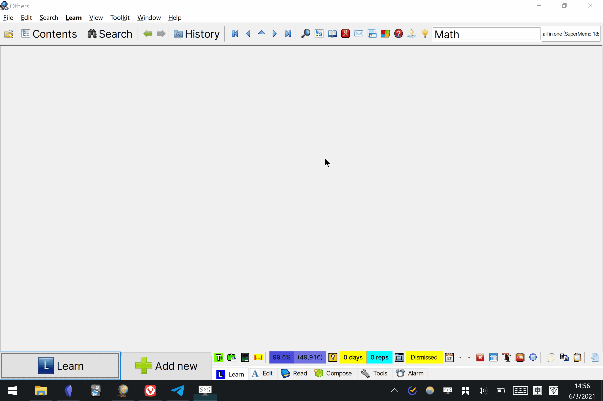

## 目录

[TOC=2,4]

## 效果演示

有点卡顿，是渣机在录屏的锅，一般不会卡滴

:-: 
```[video]
https://vdn1.vzuu.com/SD/0eb1f782-c37e-11eb-9dbe-ce906b00018b.mp4?disable_local_cache=1&auth_key=1631800553-0-0-40c2c70946624669fcf77ea51ce83ea1&f=mp4&bu=pico&expiration=1631800553&v=hw
```

:-: 
```[video]
https://vdn1.vzuu.com/SD/11df9540-c37e-11eb-8eba-a6484c14101d.mp4?disable_local_cache=1&auth_key=1631800554-0-0-4c5f14215eb7509a56883d3009709442&f=mp4&bu=pico&expiration=1631800554&v=hw
```

### 缘由

SM 有着与它的先进理念相比，非常古早且拖后腿的编辑器，几乎只能拿来输入文字。这绝对是每个试图用它来添加图片、公式或表格的人的梦魇。

一直来也有 [Image Occlusion Editor](https://zhuanlan.zhihu.com/p/326168555) 这样的图片遮挡插件来解决痛点。但是在几个月前的 windows 更新后，这个插件失效了。

**于是只能自己造轮子。** 在摸索中我发现， SM 本身是有图片遮挡的组件来帮忙实现图片遮挡的，不过在使用的时候相当繁琐，操作的速度远远赶不上思考的速度。这时借用 Quicker 可以极大地压缩这一操作成本。

经过一晚上的折腾，现在我已经基本完成了整个流程的自动化，**甚至整个的操作成本比原先在 SM 跟 Anki 上的图片遮挡插件还要低得多。**

并且，遮挡是通过组件的形式实现，也就是说**可以遮挡一个元素的任何位置**。**这一劳永逸地解决了 SM 编辑器难用带来的大部分问题，包括公式导入的难题也几乎是烟消云散。**

喜不自胜，遂分享给各位！

演示图片：

> *图片仅供演示参考，都是最近欣赏过的作品，不包含任何的用意。*

:-: 
```[video]
https://vdn1.vzuu.com/SD/956013b6-c36c-11eb-be84-aecf7b3cffb2.mp4?disable_local_cache=1&auth_key=1631800576-0-0-feffa134435f9d7d7de0919190da92ee&f=mp4&bu=pico&expiration=1631800576&v=hw
```

单图分别遮挡不同部位，生成多张卡片。这里按 Alt + D 进行了元素复制

:-: 
```[video]
https://vdn1.vzuu.com/SD/77d4f014-c367-11eb-8cf2-521fa1436282.mp4?disable_local_cache=1&auth_key=1631800583-0-0-6b74d12cf27ad7b6492e60e594f94501&f=mp4&bu=pico&expiration=1631800583&v=hw
```

单次遮挡多个部位

## 前期工作：

### 1、修改 SM 图片导入的默认 Article Picture 模板

#### 引言：

> 当我们导入图片时， SM 会弹出提示框让我们应用默认的 Article Picture 模板。

:-: 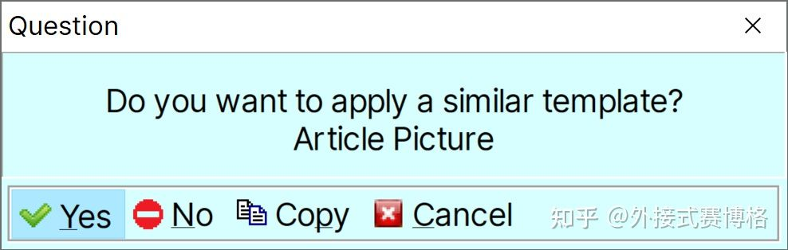

> 但是SM 默认的 Article Picture 是类似于杂志的文章占左半而图片占右半的显示方式，**这不利于横比例的图片显示**。  
> 而类似这样的杂志类型的展示需求，我们在导入的第一步不选择创建图片模板也能办到。

:-: 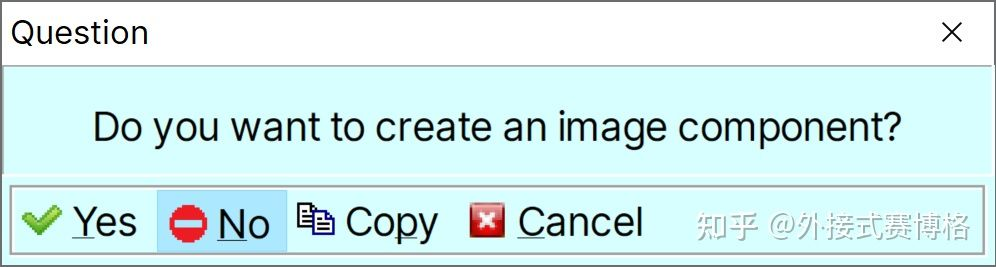

> 因此，我们可以大胆修改 Article Picture 这一默认模板以服务于我们的需求。

* * *

## 正式操作：

在剪切框中放一张任意图片，把焦点放入组件中，我们按下 Ctrl + N 以新建 Topic，之后套用 Article Picture 这一模板。

保持在组件中的焦点，按下 Ctrl + E + E 进入组件编辑模式。

:-: 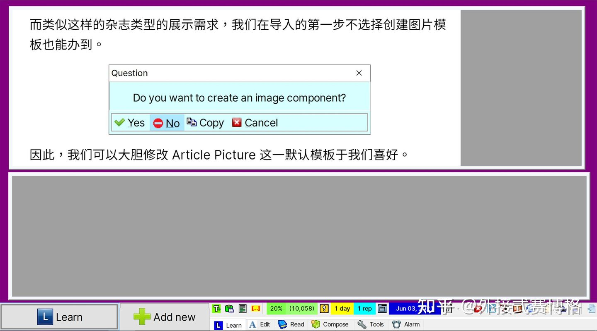

将组件拖拉为我们喜好的布局后，按 ESC 退出编辑模式。

在图片遮挡的元素中，图片是主角，但我们也需要一定的文本编辑框用于添加标题以及标签（#）以供日后的索引，可能还需要做些笔记。

因此比较推荐图片与文字上下大概是3:2的布局。

:-: 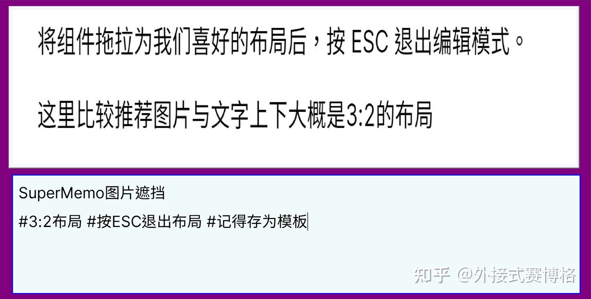

> 我们还可以给背景**换个颜色以供特殊标记、醒目图片遮挡类型的元素。**  
> 在**边缘处**右键，选择 Color ，更改即可。  
> 操作简单，这里就不上图了

**大的来了！最后一步是存为模板并覆盖 Article Picture 模板。不保存，前面的操作都白搭！**

同样是在边缘处右键，输入名字 Article Picture，覆盖即可

:-: 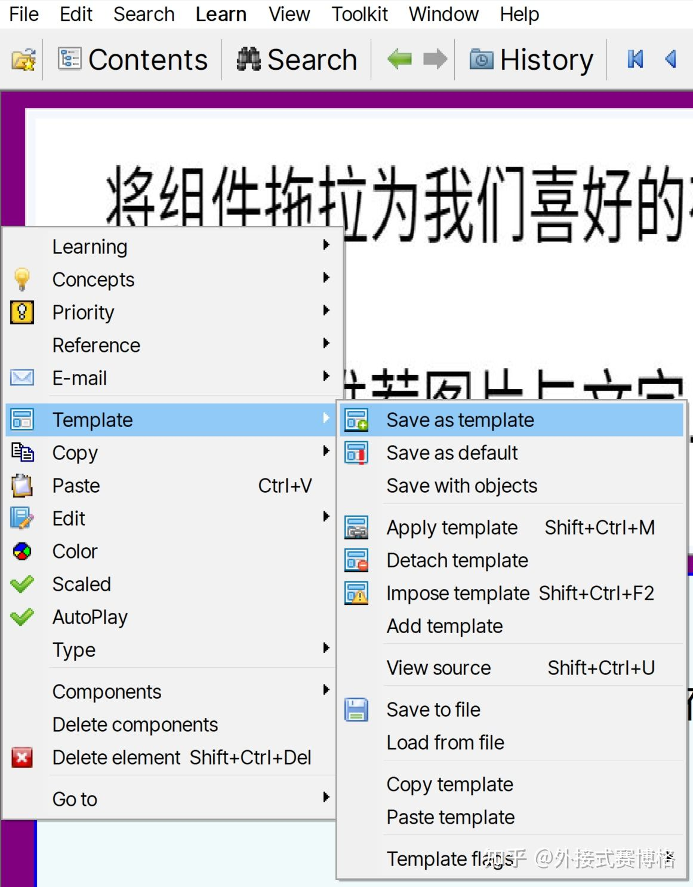

:-: 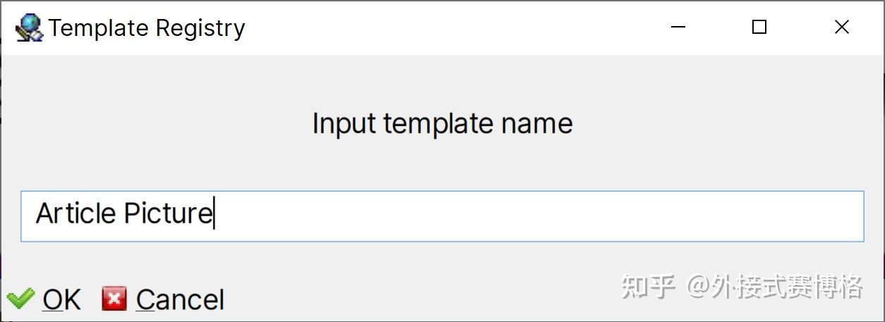

:-: 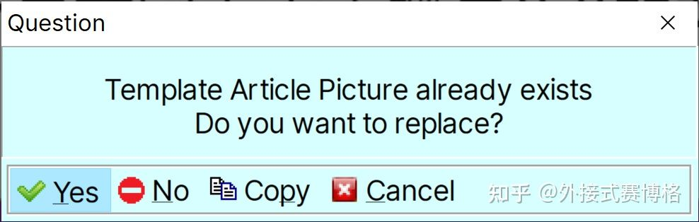

* * *

### 2、安装Quicker动作并进行必要配置

动作1：一键导入图片，切换图片展示类型为按比例，并且将元素类型修改为item。**安装即可。**

[SM全局图片一键导入 - 已分享的动作 - 知乎外接式赛博格-动作单 - Quicker](https://getquicker.net/sharedaction?code=238fb92d-c6ad-46b0-faaf-08d92451edfb)

动作2：添加遮挡，**安装后需要先进行配置。**

[此动作有更好的替代方案，请见简介 - 已分享的动作 - 知乎外接式赛博格-动作单 - Quicker](https://getquicker.net/sharedaction?code=061c1293-716f-4d08-fab0-08d92451edfb)

SM 里的遮挡组件并无自带的快捷键，也就无法通过快捷键的方式调用 Quicker，这里使用比较原始的鼠标移动的方式实现动作2。

（如你有更好的方案，不吝赐教）

值得一提的是，由于 SM 的工具栏有一定 Bug，在添加三个以上的遮挡组件后容易出现显示错误的问题从而导致鼠标操作错位，建议第三个以上的遮挡组件还是手动创建并更改展示位置。

上述的特殊情况在 95% 以上的 Work Flow 里不会存在，三个以上的遮挡蒙版大体违背记忆最小化原则而需要拆分为多个元素。这样的需求多数情况下不是动作或软件有问题，而是你有问题:D。

:-: 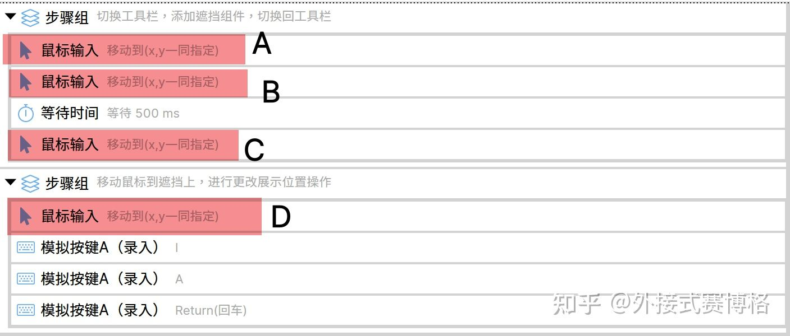

由于具体到每个人的屏幕大小、比例还有SM本身窗口布局的方案不同。**在复制好动作以后还需先进行修改鼠标位置才能使用。**

其中

*   A为单击 Compose 位置

:-: 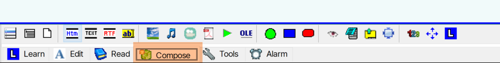

*   B为单击蒙版创建位置

:-: 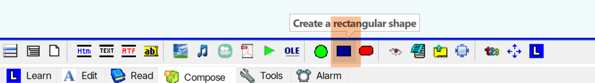

*   C是可选项，这里是点回 Learn 以方便查看卡片的优先级

:-: 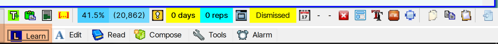

*   D是蒙版创建后的默认生成位置的中下方。具我观察发现，蒙版创建后生成的位置是固定的。把指针放在中下方是为了避免误触。

:-: 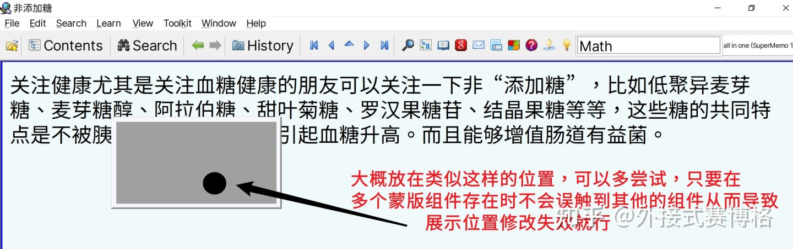

* * *

## 具体使用

配置好后使用就很简单了

动作1导入以后，动作2添加遮挡，挪动即可，很顺。

几点使用提示：

*   确保焦点后，按 Ctrl + N 导入图片，套用模板
*   用动作1：一键导入图片，切换图片展示类型为按比例，并且将元素类型修改为item。让图片按原始比例展示是避免失真。
*   用动作2：添加遮挡以添加蒙版，挪动到想要进行主动回忆的地方即可
*   欲在一个元素中遮挡更多部位，重复动作2。**在挪动位置前一次性添加好，以避免误触；** 三个以上的蒙版添加，建议通过手动。
*   欲分别遮挡不同部位，生成多张卡片，按 Alt + D 进行元素复制后再挪动即可。

单图分别遮挡不同部位，生成多张卡片。注意这里按 Alt + D 进行了元素复制

在一个元素中遮挡更多部位，重复动作2。

* * *

本文完，不经意间写了有2k字。

**如果你觉得这对你有帮助，欢迎点赞、关注。**

**也欢迎你来电报群玩，里边有很多长期使用Anki、SM的朋友，我平时也会在上面活跃。**

[Telegram: Contact @anki\_app](https://t.me/anki_app)