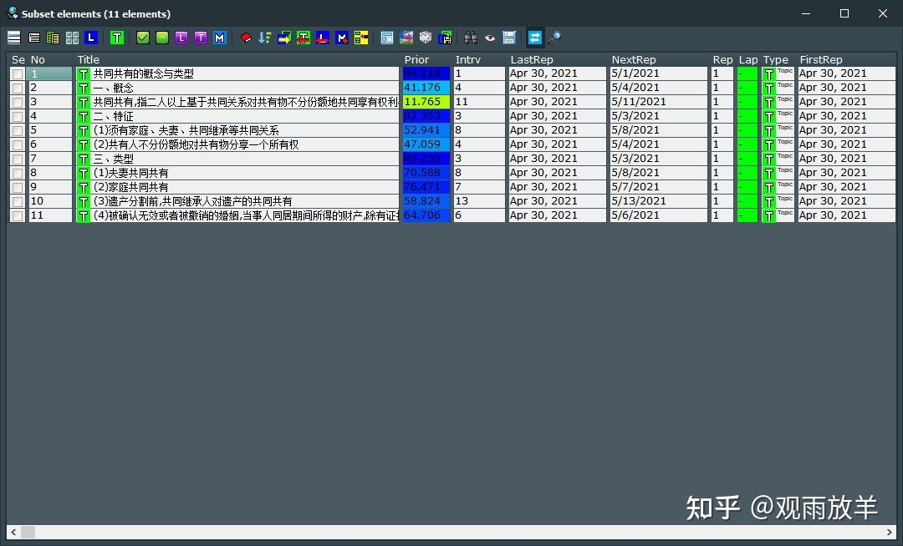

# SuperMemo: 知识树快转思维导图

> 作者：[观雨放羊](https://www.zhihu.com/people/eric0z)

## 目录

[TOC=2,4]

## 一、引言：

在渐进阅读过程中形成的SuperMemo知识树非常有助于解决记忆碎片化的问题（有关知识树的重要意义可参考[《SuperMemo 知识树与神经复习》](./2450605)）。笔者认为，知识树一则有助于建立体系，二则有助于复习过程中的知识点定位，实际使用下来其作用更偏向于后者。想要成体系的知识更加直观的显现，有比知识树这种大纲结构更为合适的形式——思维导图。在记忆知识的“碎片化”与“体系化”问题上，SuperMemo与思维导图无疑是最佳拍档。

当中有一个问题在于，“体系化”与“碎片化”孰先孰后？这可能取决于个人的学习习惯以及学习材料的差异。应该说，有相当多的同学比较赞同或者说喜欢先“体系”后“碎片”。关于这个路子，目前，已经有大佬做了一套工具（[《解决知识碎片化知识体系框架记忆之思维导图大纲笔记结合搭配Anki或Supermemo使用》](https://zhuanlan.zhihu.com/p/373651070)，如有需要也可加qq群627574819了解）来实现，可以将思维导图转换成SuperMemo卡片。笔者得悉该工具后也是喜出望外，这是先“体系”后“碎片”的一大神器！

仅于笔者个人而言，先“体系”后“碎片”的办法，体系化（制作思维导图）的过程也是阅读的过程，但这个过程是独立于SuperMemo渐进阅读过程的，无法充分利用SuperMemo的阅读内容优先级排序、阅读材料排期等功能。目前笔者在实践先“碎片”后“体系”的办法，这个路子的一大优点即是，不脱离SuperMemo渐进阅读的过程，仅将知识体系（思维导图）作为阅读结束后的总结、梳理。

## 二、转换办法：

笔者前面说得啰嗦了些，其实这个办法很简单，并没有丝毫技术含量，笔者在此予以简述，供需要的同学参考：

**第一步：**在SuperMemo中进行渐进阅读，注意设置好卡片标题。

:-: 

示例文段。

:-: 

选中标题后点击右键，从弹出菜单设置标题。也可选中后按快捷键 Alt + T。

:-: 

设置好标题。此举有助于简化导出的知识树。

**第二步：**阅读章节（或全书）完毕后，导出Document文件。这分两种情况：

*1\. 尚未挖空。*

:-: 

只是对章节(或全书)进行了拆解、摘录，知识树(Contents)中只有“Topic”(T)类型的卡片。

这种情况下就在知识树中选择相应Topic以Document格式导出。

:-: 

选中相应Topic，右键弹出菜单中选择Document，不要选HTML（虽然我们导出的的确是网页）。

*2\. 已经挖空。*

:-: 

在对章节(或全文)进行拆解、摘录(alt+x)的同时，随手进行了挖空(alt+z)，知识树中有“Topic”(T)和“Item”(L)两种类型的卡片。

在这种情况下要在卡片浏览器中试进行筛选后导出。

:-: 

在知识树中选中相应Topic，右键菜单选择View-Branch。

:-: 

在打开的浏览器窗口工具栏处，点击紫色的“T”型按钮(Leave only topics in the browser)以筛掉Item卡片。

:-: 

筛选后的知识树。

:-: 

点击浏览器窗口工具栏第一个按钮，选择Export-Document。

以下是上面两种情况选择导出Document后的界面。

:-: 

默认全选即可。也可以仅保留第二项（第二项为必须）。经笔者个人测试，无论是否全选，都会导出多余文件。

:-: 

选择保存位置。经笔者测试，保存到其他位置可能出现找不到所保存文件的情况，故笔者使用的是默认保存位置，此或为个例。

*为方便后文引述及读者识别，此处SuperMemo导出document的位置（默认或自定义）称为“原文件位置”。*

:-: 

保存成功后IE一般会自动弹出刚刚保存的网页。

**第三步：**选择网页内容，粘贴至Markdown软件（如Typora、Obsidian等）并保存。

:-: 

选择网页内容。

:-: 

粘贴至Typora并保存（保存前可根据需要进行编辑，但注意不要删除行首序号。

**第四步：**在思维导图软件（如Xmind）中导入前述Markdown文件。

:-: 

经过简单编辑美化后的思维导图。

## 三、利用Quicker动作一键转换

利用[Quicker](https://getquicker.net/)（点击链接下载）可免去前述复制网页打开软件再粘贴保存关闭软件之繁琐。笔者基于Quicker大佬[CL](https://getquicker.net/User/Actions/3-CL)的“[批量转换Markdown](https://getquicker.net/sharedaction%3Fcode%3Ddd3235c6-1710-493b-f861-08d8e37a0602)”制作了新的动作 “[HTML2MD](https://getquicker.net/sharedaction%3Fcode%3Dd939b6f2-d411-4ea1-cf69-08d90ca01f6c)”（点击链接获取动作），以实现文件一键转换，无需查找文件夹选中文件后再进行转换，同时，转换完成后能够自动将新文件移至指定位置，并自动删除原文件。

:-: 

从SuperMemo导出document文件后，唤出Quicker面板，点击HTML2MD。

:-: 

在弹出窗口中选择要转换的文件，请注意，选择“document content”而不是其他。

:-: 

在“指定位置”得到转换后的Markdown文件，即可导入思维导图软件。同时，原HTML文件（包括导出的多余文件）已经被删除了。

**HTML2MD动作配置：**

:-: 

将动作粘贴至Quicker面板，右键选择编辑。

:-: 

在主程序窗口中选择第1项“文件和目录操作”。点击右侧的编辑按钮。

:-: 

修改路径为“原文件位置”。

:-: 

接下来，对第11、14项执行同样操作，路径与第1项保持一致(即图中三角标号处路径设置一致)。

:-: 

在主程序窗口中选择第13项“文件和目录操作”。点击右侧的编辑按钮。

:-: 

修改路径为新的md文件想要移动到的指定位置。

**至此，所有配置已设定完毕。这就将SuperMemo知识树转思维导图的步骤简化为：导出document文件，点击HTML2MD，导入思维导图软件。“一导出、二点击、三导入”，一气呵成！**