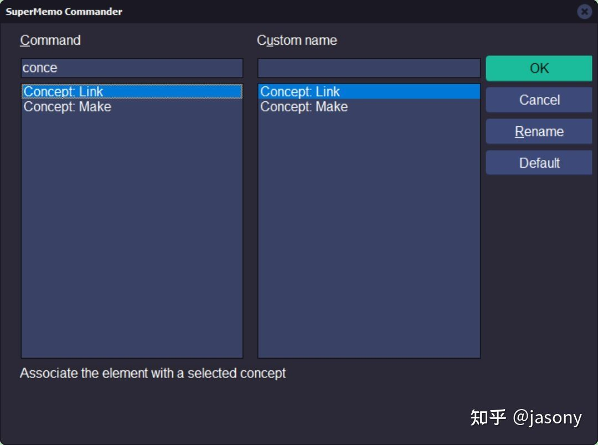

# SuperMemo 知识树与神经复习

> 作者：[jasony](https://www.zhihu.com/people/wang-jing-xuan-34-88)

## 目录

[TOC=2,4]

## 被忽视的知识树

我在学习神经复习的过程中发现自己好像严重低估了知识树的重要性，以前也只是单纯的拿知识树进行**溯源**。仔细想想其实用 [Reference](https://www.yuque.com/supermemo/wiki/references) 干这事就已经足够了。

:-: 

通过 *#title* 引用可以非常方便的追溯原文，知识树也许可以用来做更棒的事。

## 知识树结构不良的问题

**1. 不方便阅读**

我们将某书上的某一章节导入SM中，以该章节名命名并创建了一张摘录卡。经过几轮渐进后挖空了几十张问答卡片。这时候目录中的元素就会显得格外的凌乱。知识点之间没有联系也不存在层级结构，卡片密密麻麻的根本无从阅读。

:-: 

**2. 冗余**

如果两本书的知识点有大量重合，阅读的过程中由于卡片分散在不同的目录中，想进行对比会非常麻烦。大量知识点相同的卡片对我们复习并没有益处，因为真正有效的学习是：[忘记后的重拾](https://www.zhihu.com/question/27252044/answer/109590714)。频繁测试相同的内容没有太大意义。

[学过的东西马上就忘了怎么办？](https://www.zhihu.com/question/27252044/answer/109590714)

## 为什么要保持知识树结构良好？

1.  组织知识树的过程会迫使自己去**建立知识点之间的联系**，除了能干掉冗余之外，也可能在对比中产生一些新的**洞见**，这对于创造性的工作非常有意义
2.  良好的知识树结构能帮助我们更好的进行**神经复习**
3.  **增量写作**实际上就是渐进组织知识树的过程

> 正确执行的增量学习会以知识树的形式构建已处理知识的语义结构。父级、同级和子级在意义上是相互关联的——[神经学习成本](https://www.yuque.com/supermemo/wiki/costs_of_neural_learning)

这是神经复习文章中博士的原话，正确的增量学习是需要保持结构良好的知识树的。

## 神经复习是什么？

神经复习可以针对一个知识点进行发散复习，SuperMemo会自动去追踪那些相关联的知识，这是一种**模拟大脑思考的仿生模式**。同时它也具有一定的**随机性**，因为跳出框架外的思考也可能会冒出新的灵感。

## 概念

SuperMemo中的概念是一种元素类型，我们可以当作是一个想法，一个学习主题。

:-: 

黄色灯泡就是概念图标

## 将元素转换为概念

要将元素转换为概念，可以按下**Ctrl + Enter**打开**Commander**中输入**Concept: Make**

:-: 

也可以选中元素按下**Ctrl + K**

> 转换概念时注意命名的简洁，方便我们后续进行链接

## 将元素链接到概念

我们可以将某个元素链接到一个概念上时，这表示这个元素与概念之间存在着关联性。当我们在这个元素上启动神经复习时，扩散激活就会传播到关联的概念上

## 建立链接的方式

1.  选中元素，按下**Ctrl + Enter**打开**Commander**
2.  输入**Concept : Link**
3.  选择概念
4.  点击“**Accept**”

:-: 

## 查看元素的链接列表

我们可以在知识树中选中元素，从主菜单中选择**View > Link list**查看该元素已建立的所有链接

:-: 

## 取消链接的方式

1.  选中元素后，右键元素菜单选择**Concepts > Unlink concept**
2.  选择概念
3.  点击“**Accept**”

:-: 

## 扩散激活

SuperMemo会根据扩散激活的规则进行神经复习，这是一种利用**连接和权重**进行检索的方法。

扩展激活是一种激活神经网络、语义网络、有向图等节点的算法。在SuperMemo中，**图是由知识树、概念链和元素间的语义连接构成**。也就是说除了链接以外，**知识树也会参与扩散激活**，这也是为什么我认为有必要保持知识树结构良好的原因。

所有用于扩散激活的链接都会根据其重要性获得一个权重。权重由元素优先级和单个知识关联的优先级决定（例如，概念连接的优先级高于知识树中的同级关系）

详细规则可以参考这里

[扩散激活 · 语雀](https://www.yuque.com/supermemo/wiki/nmx1v6)

## 查看扩散激活是如何传播的

神经复习队列可以更直观的观察扩散激活是如何传播的

在主菜单选择**View >>Neural queue**打开神经复习队列浏览器

:-: 

:-: 

## 开始神经复习

在知识树中选中你感兴趣的元素，按**Ctrl+F2**进入神经复习，或者在浏览器菜单上选择 Learn >>**Go neural**

:-: 

## 停止复习

不想复习了，按下**Esc**键

* * *

## 把SM当笔记软件使用

之前我一直在想一个问题，SM渐进后的知识点如何导入到自己的笔记系统中？  

最近在学习神经复习的过程中，我意识到SM本身就可以当作是笔记系统。  
只要我的知识树层次结构清晰明确，我就可以快乐的阅读，如果能借助AutoHotKey来实现tab 缩进，shift-tab 减少缩进，这个知识树是不是有点大纲笔记内味了？  

而且SuperMemo元素链接是双向的，也许SuperMemo也可以当成“双链大纲笔记”来用，虽然用起来有些别捏。。。

## 知识树与增量写作

这篇文章是使用增量写作的方式完成的，SM的文字编辑足以满足我基本的写作需求了。因此对我个人来说知识树还有用的。

即便不使用神经复习，我认为定期整理知识树也是有必要的，因为组织的过程中能够去掉大量冗余卡片，也能更好的帮助我梳理知识点之间的联系。更妙的是，结构良好的知识树，天然就适合导出进行增量写作。

:-: 

## 其它

虽然Supermemo的文本编辑功能的体验很差，但在间隔复习领域还是非常能打的。  
我个人也并不在意算法是**SM-2**还是**SM-17**，但我认为没有优先级队列的复习软件是有设计缺陷的。因此即便remnote的笔记体验很爽，但考虑到复习短板我暂时也不会打算完全切换。

目前也的确不存在兼具“**笔记**”和“**间隔复习**”两大功能又能在各方面表现完美的软件。也不用想着 all in one，组合起来用才是最爽的。

（**关于优先级的重要性可以参考叶神的这篇文章**）

> [渐进阅读：卡片刷不完？拥抱优先级！](./2450604)